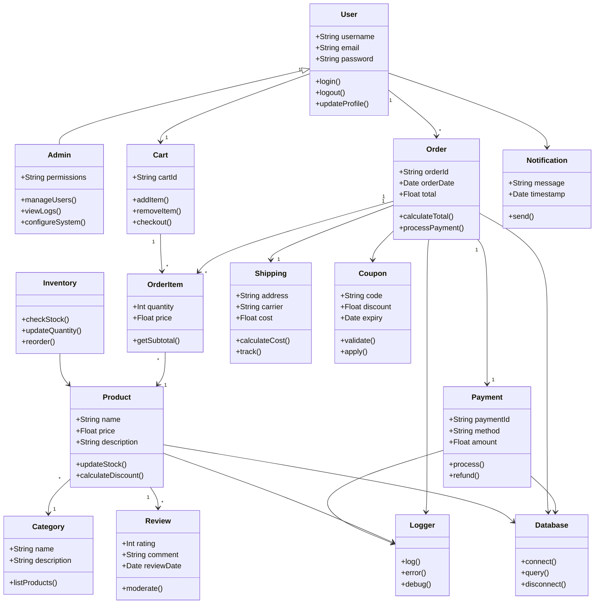

# Class Diagram - Bad Example

This example shows an overcrowded class diagram that triggers width and complexity warnings.

## Issue: Too Many Classes in One Diagram

**Problem:** This class diagram tries to show an entire system architecture with 15+ classes, making it overwhelming and too wide.

**Mermaid-Sonar Output:**
- ❌ **ERROR:** Estimated width: ~2000px (exceeds 1500px error threshold)
- ❌ **15 classes** - too many to comprehend at once
- ❌ **27 relationships** - creates visual spaghetti
- ⚠️ High cognitive load - viewers can't identify key patterns
- Suggestion: Split into focused domain diagrams

## Why This Is a Problem

1. **Information overload** - too much to process at once
2. **Lost focus** - can't identify the main architectural patterns
3. **Hard to maintain** - changes require updating massive diagram
4. **Poor documentation** - can't explain specific subsystems clearly
5. **Width issues** - requires horizontal scrolling
6. **Relationship spaghetti** - arrows crossing everywhere

## See the Fix

Check [class-diagram-good.md](./class-diagram-good.md) for focused, domain-separated diagrams.
