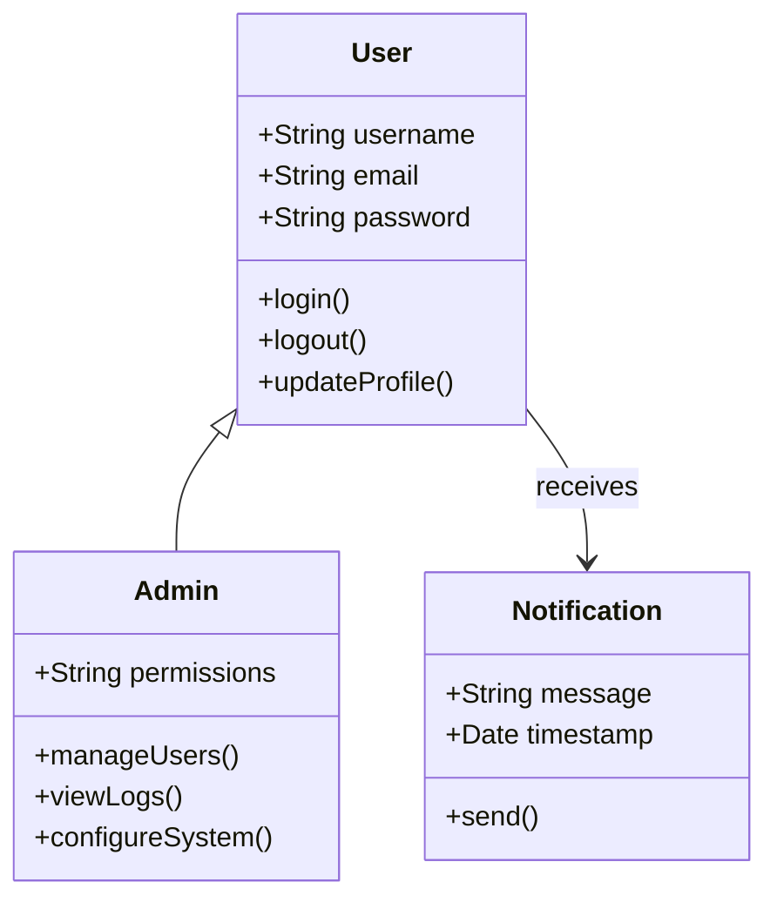
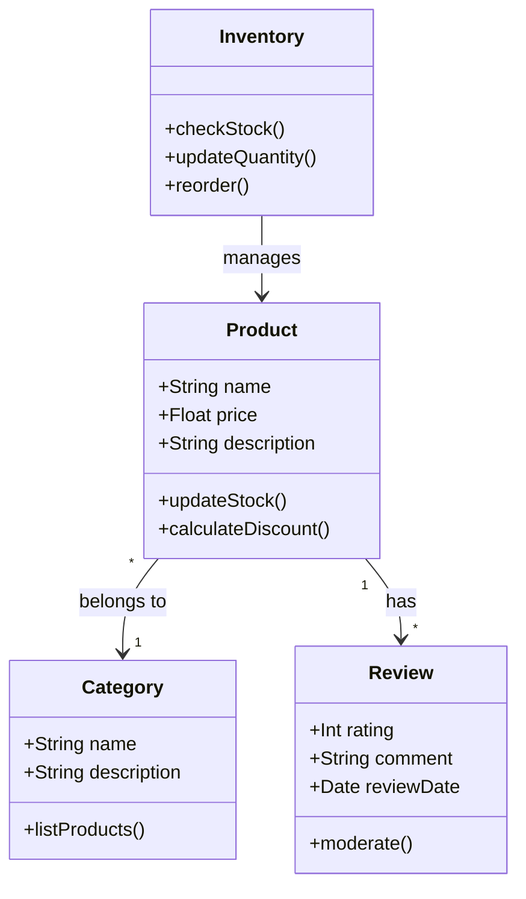
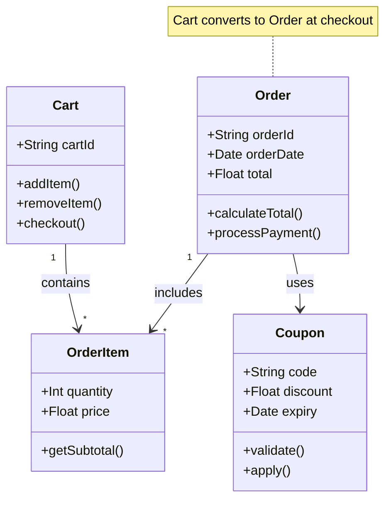
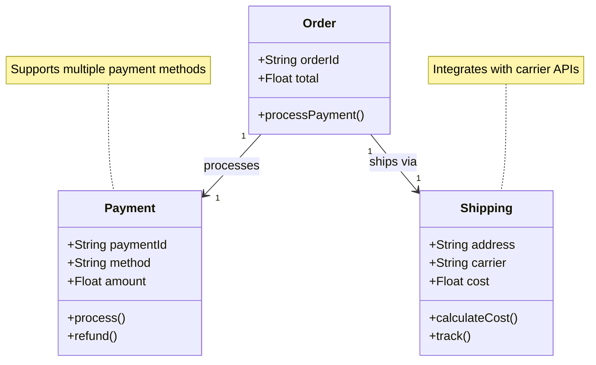
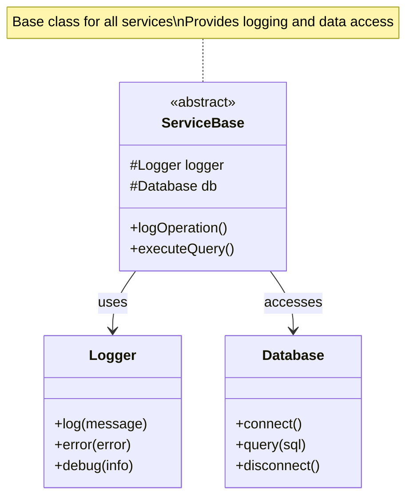
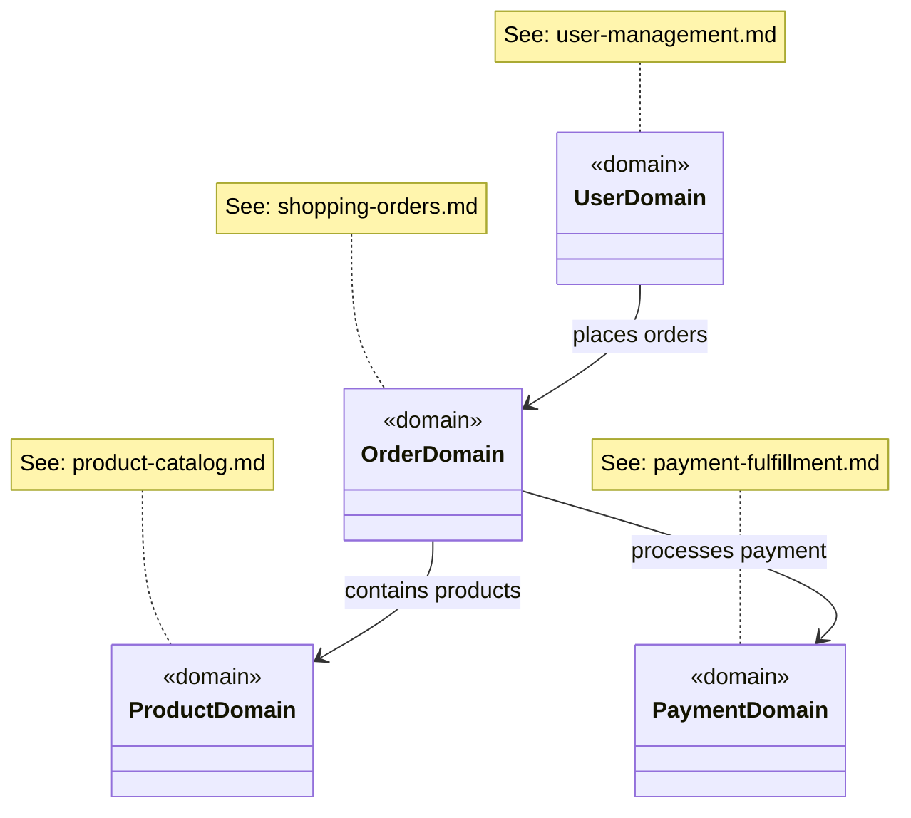

# Class Diagram - Good Example

This example shows the refactored class diagrams split into focused domain areas.

## Solution: Split into Domain-Focused Diagrams

Instead of one overwhelming diagram, we create focused diagrams for each domain area.

### Domain 1: User Management

**Focus:** Authentication, authorization, and user profiles

**Improvements:**
- ✅ 3 classes - easy to understand
- ✅ Clear inheritance relationship
- ✅ Focused on authentication domain

### Domain 2: Product Catalog

**Focus:** Products, categories, and reviews

**Improvements:**
- ✅ 4 classes - focused scope
- ✅ Clear product lifecycle
- ✅ Easy to understand inventory relationship

### Domain 3: Shopping & Orders

**Focus:** Cart, orders, and order items

**Improvements:**
- ✅ 4 classes - clear shopping flow
- ✅ Shows cart-to-order transformation
- ✅ Coupon integration is obvious

### Domain 4: Payment & Fulfillment

**Focus:** Payment processing and shipping

**Improvements:**
- ✅ 3 classes - clear payment flow
- ✅ Shows one-to-one relationships
- ✅ Notes provide integration context

### Domain 5: Infrastructure (Optional)

**Focus:** Cross-cutting concerns like logging and data access

**Improvements:**
- ✅ Shows infrastructure pattern
- ✅ Abstract base class clearly marked
- ✅ Explains cross-cutting concerns

## System Overview (Optional)

If you need a high-level overview, show **only** the main domain relationships:

**Benefits of high-level overview:**
- ✅ Shows architecture at domain level
- ✅ Links to detailed domain diagrams
- ✅ Keeps cognitive load minimal

## Key Takeaways

1. **One diagram = One domain** - Keep diagrams focused on a single area
2. **5-8 classes maximum** per diagram for readability
3. **Use notes** to provide context and link to related diagrams
4. **Create a high-level overview** that links to detailed diagrams
5. **Each diagram should answer one question** - not show the entire system
6. **Organize by business domains** - not technical layers

## Benefits of This Approach

- ✅ **Easier to understand** - each diagram has clear purpose
- ✅ **Easier to maintain** - update only relevant diagram
- ✅ **Better documentation** - can explain each domain independently
- ✅ **Fits in viewports** - no horizontal scrolling
- ✅ **Printable** - each diagram fits on one page
- ✅ **Onboarding friendly** - new team members learn domain by domain
