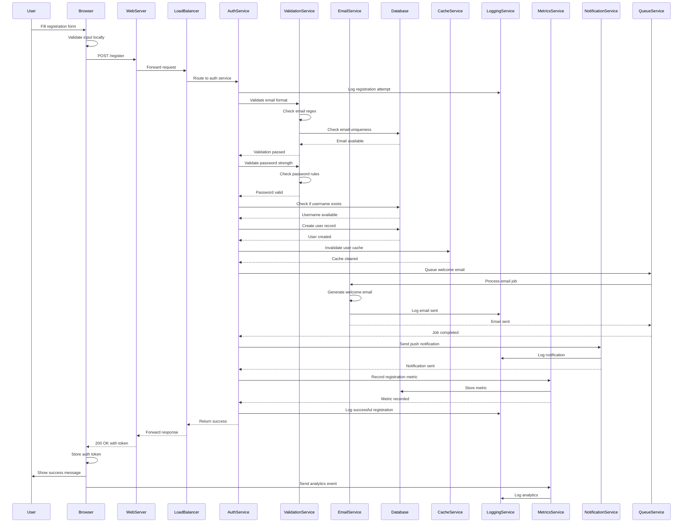

# Sequence Diagram - Bad Example

This example shows an overly complex sequence diagram that triggers width and height warnings.

## Issue: Too Many Participants and Messages

**Problem:** This sequence diagram tries to show an entire user registration flow with too many services and interactions.

**Mermaid-Sonar Output:**
- ❌ **ERROR:** Estimated width: ~2100px (13 participants × 160px)
- ❌ **ERROR:** Estimated height: ~1850px (42 messages + nesting)
- ❌ **13 participants** - too wide for any standard viewport
- ❌ **42 messages** - too much information in one diagram
- ⚠️ High cognitive load - impossible to follow the main flow
- ⚠️ Mixed abstraction levels (browser validation + infrastructure logging)
- Suggestion: Split into focused interaction scenarios

## Why This Is a Problem

1. **Information overload** - can't identify the critical path
2. **Width issues** - requires significant horizontal scrolling
3. **Height issues** - very long vertical scroll
4. **Mixed concerns** - combines UI, business logic, and infrastructure
5. **Hard to maintain** - any service change affects the massive diagram
6. **Lost in details** - logging and metrics obscure main flow
7. **Poor for documentation** - can't explain specific scenarios clearly

## Visual Problems

- Too many vertical lines make it hard to track interactions
- Message arrows cross multiple participants
- Return arrows get lost in the noise
- Can't see which interactions are critical vs. optional
- Infrastructure concerns (logging, metrics) clutter the main flow

## See the Fix

Check [sequence-diagram-good.md](./sequence-diagram-good.md) for focused, scenario-based diagrams.
