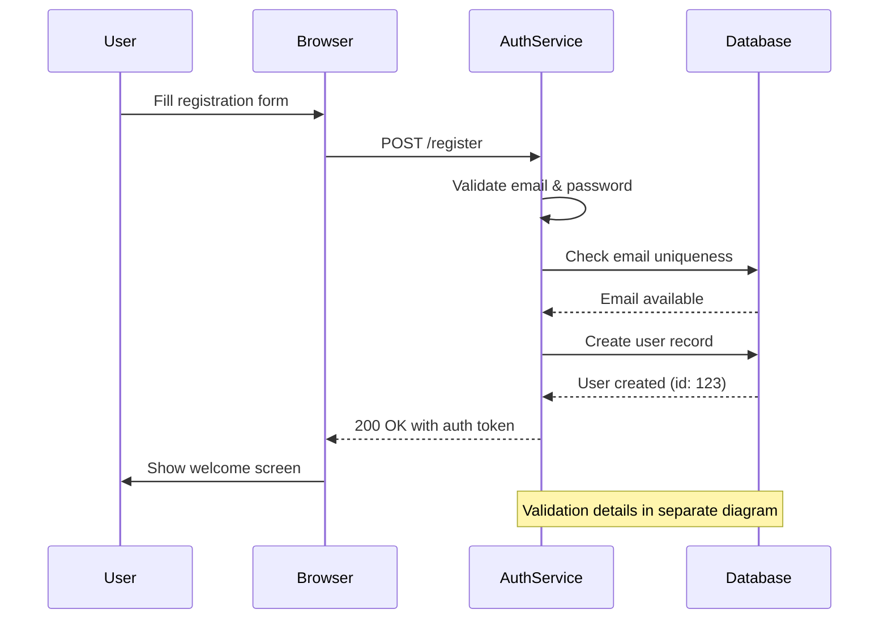
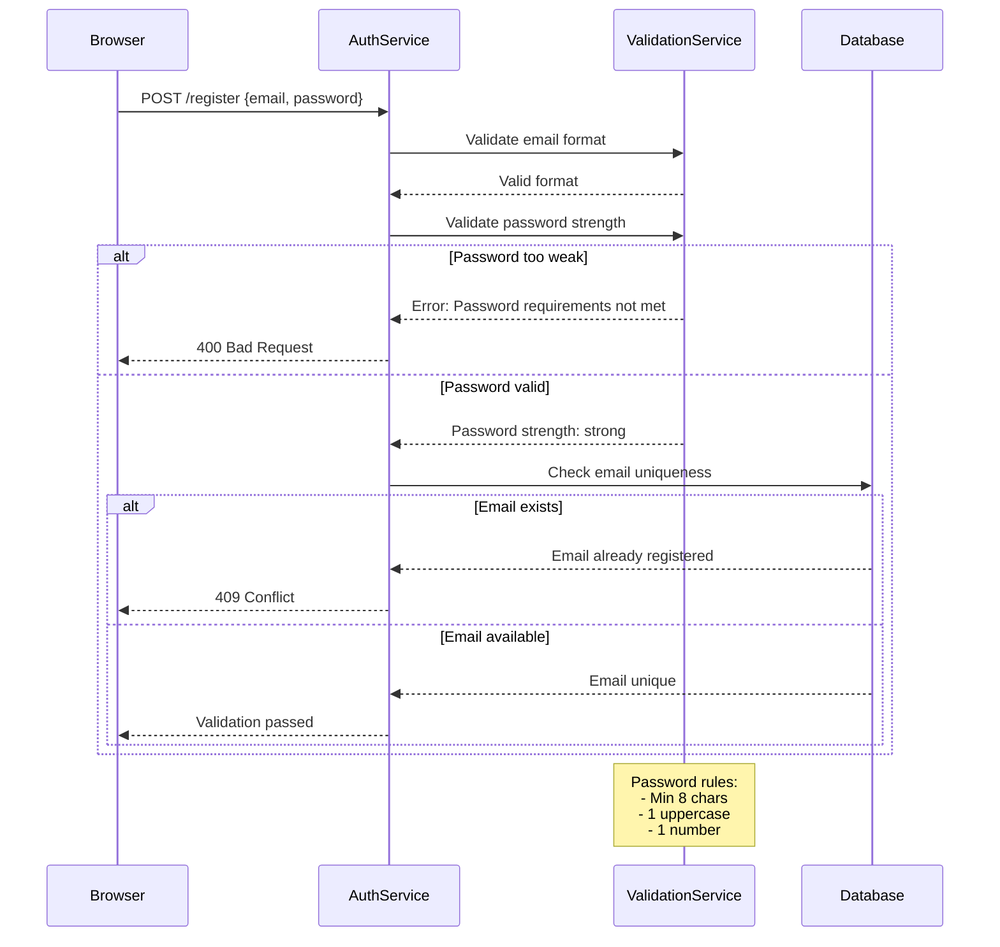
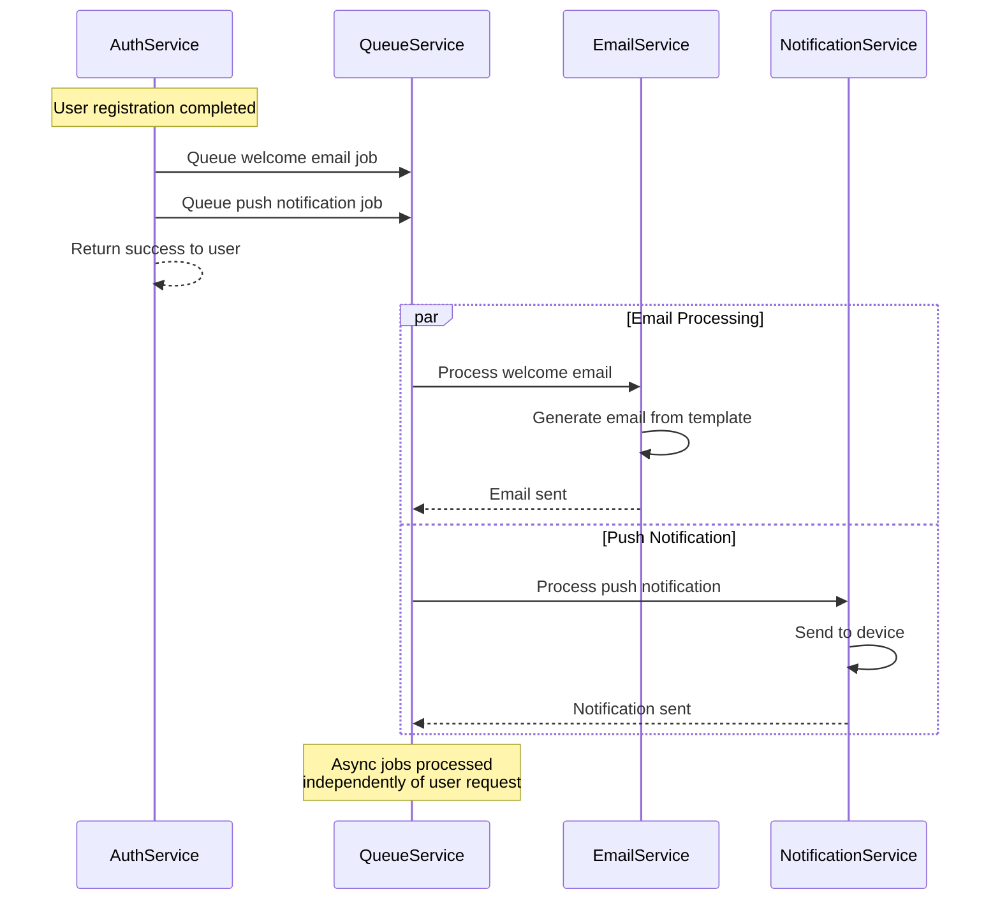
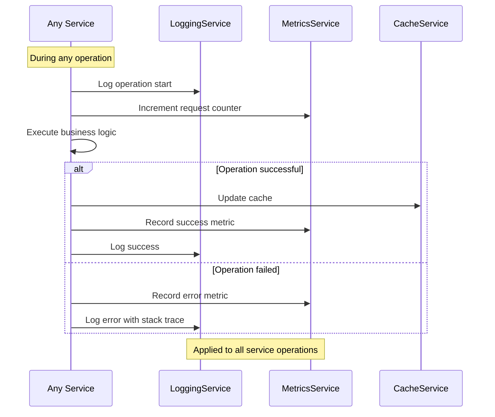
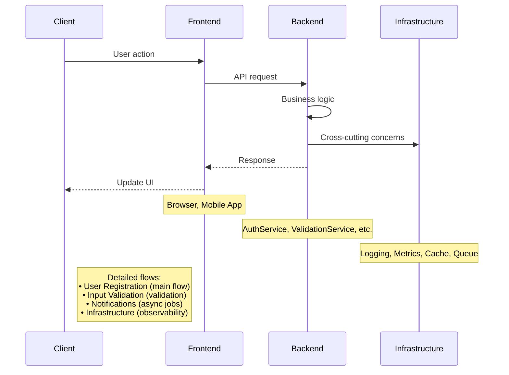
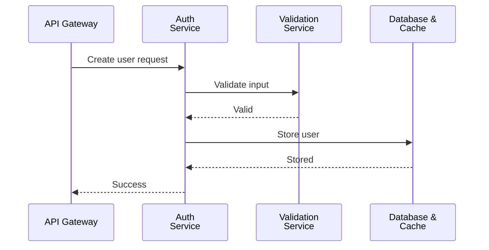

# Sequence Diagram - Good Example

This example shows the refactored sequence diagrams split into focused interaction scenarios.

## Solution: Split into Scenario-Focused Diagrams

Instead of one overwhelming diagram, we create focused diagrams for each interaction scenario.

### Scenario 1: User Registration Flow (Happy Path)

**Focus:** Core registration logic without infrastructure noise



**Improvements:**
- ✅ 4 participants - clear and focused
- ✅ 8 messages - easy to follow
- ✅ Shows only the critical path
- ✅ Fits standard viewport (640px width, ~480px height)
- ✅ Note references detailed validation flow

### Scenario 2: Input Validation Details

**Focus:** Validation logic and error handling



**Improvements:**
- ✅ 4 participants - manageable width
- ✅ Shows error scenarios with alt blocks
- ✅ Focused on validation logic only
- ✅ Note explains validation rules
- ✅ ~720px height - fits viewport

### Scenario 3: Post-Registration Notifications

**Focus:** Asynchronous notifications after successful registration



**Improvements:**
- ✅ 4 participants - focused on notifications
- ✅ Shows async nature with par block
- ✅ Clear that user doesn't wait for these
- ✅ ~560px height - compact and clear

### Scenario 4: Infrastructure & Observability (Optional)

**Focus:** Cross-cutting concerns for operations team



**Improvements:**
- ✅ Shows pattern applicable to all services
- ✅ Separates infrastructure from business logic
- ✅ Relevant for operations/SRE team
- ✅ ~520px height - very focused

## System Context (Optional)

If you need a high-level overview of the services involved:



**Benefits:**
- ✅ Shows system layers at high level
- ✅ Links to detailed scenario diagrams
- ✅ 4 participants - very simple
- ✅ Provides navigation to detailed flows

## Alternative: Group by System Layer

If the service count is the main issue, group by architectural layers:

### User-Facing Flow
```mermaid
sequenceDiagram
    participant User
    participant Browser
    participant API Gateway as API<br/>Gateway
    participant Backend Services as Auth &<br/>Validation<br/>Services

    User->>Browser: Register
    Browser->>API Gateway: POST /register
    API Gateway->>Backend Services: Validate and create user
    Backend Services-->>API Gateway: User created
    API Gateway-->>Browser: Success + token
    Browser-->>User: Welcome!

    note over Backend Services: Details in backend diagram
```

### Backend Services Flow


## Key Takeaways

1. **One diagram = One scenario** - Focus on a specific use case
2. **4-6 participants maximum** for readability (640-960px width)
3. **10-15 messages maximum** for comprehension (~600-900px height)
4. **Separate concerns:**
   - Happy path vs error handling
   - Sync vs async operations
   - Business logic vs infrastructure
5. **Use notes** to reference related diagrams
6. **Show critical path first** - details in separate diagrams
7. **Group by abstraction level** - don't mix UI, business, and infrastructure

## Benefits of This Approach

- ✅ **Easier to understand** - each diagram tells one story
- ✅ **Easier to maintain** - update only the relevant scenario
- ✅ **Better documentation** - can explain each scenario independently
- ✅ **Fits in viewports** - no scrolling required
- ✅ **Printable** - each diagram fits on one page
- ✅ **Testable** - scenarios map directly to test cases
- ✅ **Reviewable** - can discuss specific interactions without noise

## Mapping to Tests

Each scenario diagram can map to a test suite:

- **Scenario 1** → `test_user_registration_happy_path()`
- **Scenario 2** → `test_registration_validation_errors()`
- **Scenario 3** → `test_post_registration_notifications()`
- **Scenario 4** → Integration tests for observability
