# State Diagram - Bad Example

This example shows a horizontally-oriented state machine that triggers width readability warnings.

## Issue: Wide Horizontal State Machine

**Problem:** This state diagram uses LR (left-right) orientation with many sequential states, making it too wide for most viewports.

```mermaid
stateDiagram-v2
    direction LR
    [*] --> Idle
    Idle --> ValidatingInput
    ValidatingInput --> FetchingUserData
    FetchingUserData --> AuthenticatingUser
    AuthenticatingUser --> LoadingPreferences
    LoadingPreferences --> InitializingSession
    InitializingSession --> CheckingPermissions
    CheckingPermissions --> LoadingDashboard
    LoadingDashboard --> RenderingUI
    RenderingUI --> Ready
    Ready --> [*]
```

**Mermaid-Sonar Output:**
- ⚠️ Estimated width: ~1650px (exceeds 1500px threshold)
- Horizontal chain length: 11 states (exceeds 8 node limit for LR)
- Suggestion: Convert to TD (top-down) layout or split into phases

## Why This Is a Problem

1. **Requires horizontal scrolling** on most screens
2. **Hard to follow** the flow without moving viewport
3. **Poor mobile experience** - essentially unreadable on phones
4. **Screenshot issues** - won't fit in documentation images
5. **Print problems** - gets cut off on standard paper sizes

## See the Fix

Check [state-diagram-good.md](./state-diagram-good.md) for the refactored version.
