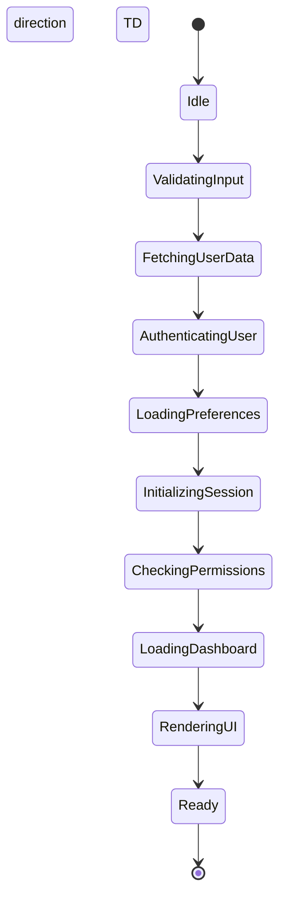
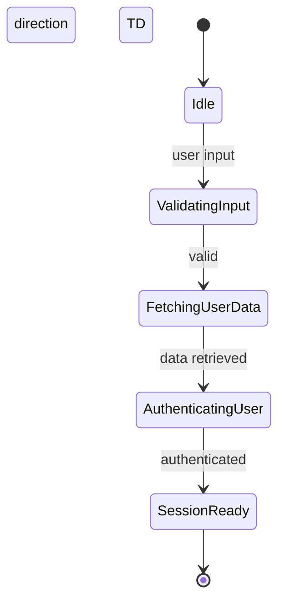
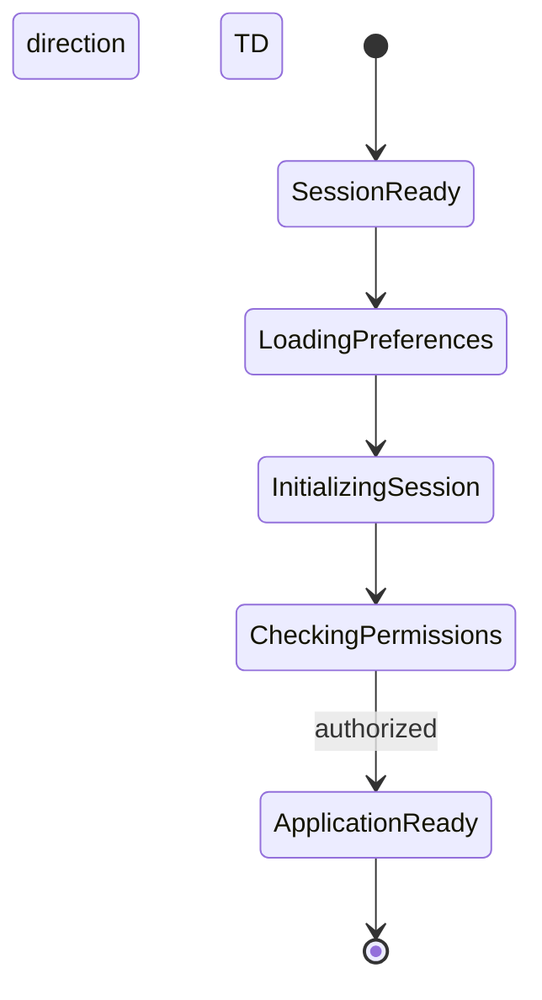
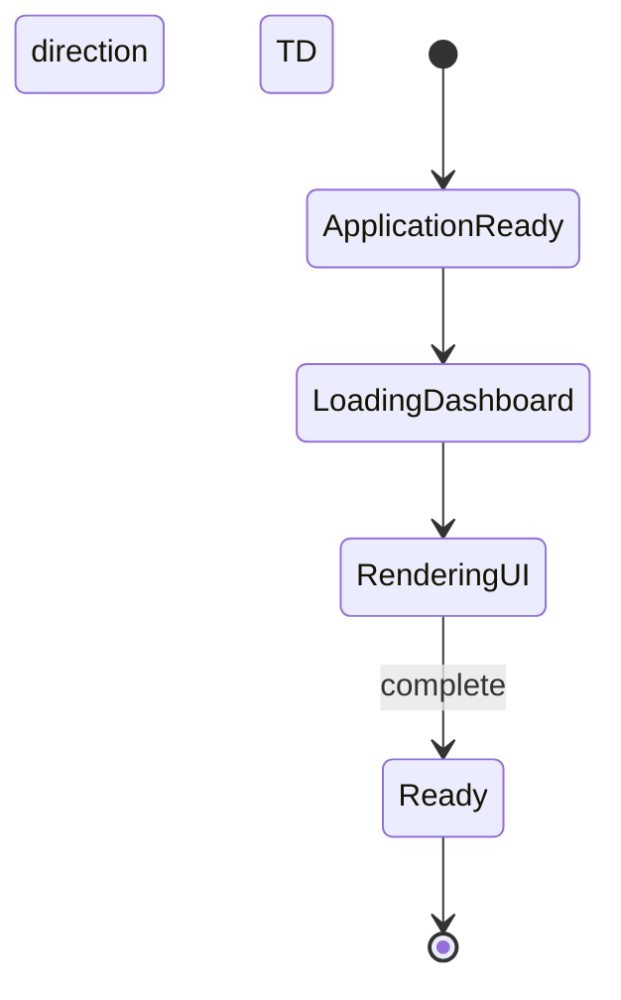

# State Diagram - Good Example

This example shows the refactored state machine with better readability.

## Solution 1: Convert to Top-Down Layout

**Fix:** Changed from LR to TD orientation, which naturally fits viewport constraints.

**Improvements:**
- ✅ Fits standard viewport height (~800px)
- ✅ No horizontal scrolling required
- ✅ Natural reading flow (top to bottom)
- ✅ Works well on all screen sizes

## Solution 2: Group into Logical Phases

**Alternative:** Break the state machine into logical phases for better understanding.

### Phase 1: Authentication & Setup

### Phase 2: Session Initialization

### Phase 3: UI Rendering

**Improvements:**
- ✅ Each diagram is focused and easy to understand
- ✅ Clear separation of concerns
- ✅ Can be documented with phase-specific notes
- ✅ Easier to maintain and update individual phases

## Key Takeaways

1. **Vertical layouts (TD/TB) are almost always better** for sequential flows
2. **Group related states** into logical phases when flows get long
3. **Consider your documentation medium** - what viewport will readers use?
4. **Split complex state machines** into subsystems or phases
