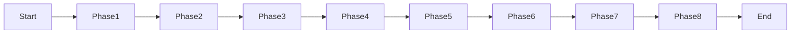

# Specification 001: Horizontal Width Readability Rule

**Category**: optimization
**Priority**: high
**Status**: draft
**Dependencies**: None

## Context

When analyzing Mermaid diagrams, individual rules (like `max-nodes`, `long-labels`, and `horizontal-chain-too-long`) successfully detect isolated complexity issues. However, there's a critical readability problem that occurs when **multiple factors combine** to create diagrams that are **too wide for standard viewports**:

### LR/RL Layout Width Issues

1. **Many nodes in sequence** (even below the absolute max-nodes threshold)
2. **Long node labels** (verbose text)
3. **Horizontal layout** (LR/RL direction)

This combination creates horizontal diagrams that:
- Require excessive horizontal scrolling
- Text becomes too small when scaled to fit viewports
- Node labels overlap or become cramped
- Are technically valid by individual rule standards but practically unreadable

### TD/TB Layout Width Issues

While vertical scrolling is natural and acceptable for TD layouts, **horizontal width** is still constrained by viewport limits:

1. **Wide branching** (many parallel children from a single node)
2. **Long node labels** (verbose text in each branch)

This combination creates:
- Excessive horizontal expansion even in top-down layouts
- Forced horizontal scrolling despite vertical layout
- Poor readability on standard viewports (1280-1920px wide)

**Key insight**: Vertical scrolling is natural and expected; horizontal scrolling breaks UX regardless of layout direction.

**Real-world example**: The "overlapping matches" diagram in the ripgrep documentation (http://127.0.0.1:8000/BurntSushi/ripgrep/context-lines/#using-heading-with-context) demonstrates this issue - the LR layout with many nodes and long labels makes the text illegibly small.

## Objective

Implement a composite readability rule (`horizontal-width-readability`) that detects when diagrams will exceed reasonable viewport widths due to the **combination** of layout direction, node count/branching, and label length.

## Requirements

### Functional Requirements

1. **Detect layout direction**
   - Parse diagram content to identify layout: `LR`, `RL`, `TD`, `TB`
   - Apply layout-specific width calculation logic

2. **Calculate label metrics** (all layouts)
   - Extract all node labels from diagram
   - Calculate average label length across all nodes
   - Calculate maximum label length
   - Determine character width estimate (monospace assumption: ~8px/char)

3. **Calculate estimated horizontal width** (layout-specific)

   **For LR/RL layouts**:
   ```
   estimatedWidth = node_count × avg_label_length × char_width + spacing
   ```

   **For TD/TB layouts**:
   ```
   estimatedWidth = max_branch_width × avg_label_length × char_width + spacing
   ```

   Where:
   - `char_width` ≈ 8px (monospace estimate)
   - `spacing` ≈ 50px per node (Mermaid default spacing)

4. **Apply composite scoring**
   - Combine layout-specific width calculation with label metrics
   - Calculate readability score based on viewport thresholds
   - Use tiered severity (info → warning → error) based on estimated width
   - Target viewport width: 1200px (safe for 1280px+ displays)

5. **Generate actionable suggestions** (layout-specific)

   **For LR/RL layouts**:
   - Recommend converting to TD layout for better vertical scrolling
   - Suggest breaking into multiple sequential diagrams
   - Suggest using shorter labels or abbreviations

   **For TD/TB layouts**:
   - Recommend grouping branches into subgraphs
   - Suggest using shorter labels to reduce node width
   - Suggest splitting wide branches into separate diagrams
   - Note: Do NOT suggest converting to LR (would make width worse)

6. **Coordinate with existing rules**
   - Don't duplicate warnings from `max-nodes` or `long-labels`
   - Provide unique value by detecting the **combination** effect on width
   - Coordinate with `max-branch-width` (don't duplicate TD warnings)
   - Integrate with `layout-hint` rule (don't contradict recommendations)

### Non-Functional Requirements

1. **Performance**
   - Rule execution should complete in <50ms for typical diagrams
   - Label extraction should be efficient (single pass through content)
   - No dependency on external rendering engines

2. **Accuracy**
   - False positive rate <10% (shouldn't flag readable diagrams)
   - Should catch 90%+ of problematic LR diagrams
   - Thresholds should be validated against real-world examples

3. **Configurability**
   - All thresholds must be configurable via `.sonarrc.json`
   - Default values should work for 80% of use cases
   - Support for disabling rule entirely

## Acceptance Criteria

- [ ] Rule detects all layout directions correctly (LR, RL, TD, TB)
- [ ] Extracts and calculates label metrics (avg length, max length)
- [ ] Calculates layout-specific width estimates (LR: sequential, TD: branching)
- [ ] Implements composite width scoring algorithm with viewport thresholds
- [ ] Triggers at appropriate thresholds for both LR and TD layouts
- [ ] Generates layout-specific actionable suggestions
- [ ] Does NOT trigger on diagrams within reasonable width limits
- [ ] Does NOT suggest LR conversion for wide TD diagrams (would worsen width)
- [ ] Configurable via `.sonarrc.json` with all thresholds exposed
- [ ] Integrated into rule registry (`src/rules/index.ts`)
- [ ] Added to default config (`src/config/defaults.ts`)
- [ ] Documented in `docs/rules.md` with examples for both LR and TD cases
- [ ] Unit tests cover both LR and TD width calculations
- [ ] Integration tests include real-world examples (ripgrep LR diagram, wide TD tree)
- [ ] Performance validated (<50ms execution time)

## Technical Details

### Implementation Approach

1. **Create new rule file**: `src/rules/horizontal-width-readability.ts`

2. **Layout detection logic**:
   ```typescript
   function detectLayout(diagram: Diagram): LayoutDirection {
     // Parse content for 'graph LR', 'flowchart TD', etc.
     // Return: 'LR' | 'RL' | 'TD' | 'TB'
   }
   ```

3. **Label extraction logic**:
   ```typescript
   interface LabelMetrics {
     labels: Array<{ nodeId: string; label: string }>;
     avgLength: number;
     maxLength: number;
   }

   function extractLabels(content: string): LabelMetrics {
     // Match patterns: A[label], B{label}, C((label)), etc.
     // Calculate avg and max in single pass
   }
   ```

4. **Width estimation** (layout-specific):
   ```typescript
   function estimateWidth(
     layout: LayoutDirection,
     metrics: Metrics,
     labelMetrics: LabelMetrics
   ): number {
     const CHAR_WIDTH = 8;  // pixels per character (monospace)
     const NODE_SPACING = 50; // Mermaid default spacing

     if (layout === 'LR' || layout === 'RL') {
       // Horizontal layouts: width = nodes in sequence
       return metrics.nodeCount * labelMetrics.avgLength * CHAR_WIDTH +
              metrics.nodeCount * NODE_SPACING;
     } else {
       // Vertical layouts: width = max branch width
       return metrics.maxBranchWidth * labelMetrics.avgLength * CHAR_WIDTH +
              metrics.maxBranchWidth * NODE_SPACING;
     }
   }
   ```

5. **Width readability scoring**:
   ```typescript
   interface WidthScore {
     estimatedWidth: number;  // pixels
     targetWidth: number;     // 1200px safe threshold
     exceedsBy: number;       // pixels over target
     severity: Severity;
   }

   function calculateWidthScore(estimatedWidth: number): WidthScore {
     const TARGET_WIDTH = 1200;  // Safe for 1280px+ displays

     const exceedsBy = estimatedWidth - TARGET_WIDTH;

     if (exceedsBy <= 0) {
       return { estimatedWidth, targetWidth: TARGET_WIDTH, exceedsBy: 0, severity: null };
     }

     // Severity based on how much we exceed
     if (exceedsBy < 300) return { ..., severity: 'info' };      // 1200-1500px
     if (exceedsBy < 800) return { ..., severity: 'warning' };   // 1500-2000px
     return { ..., severity: 'error' };                          // 2000px+
   }
   ```

6. **Threshold configuration**:
   ```json
   {
     "horizontal-width-readability": {
       "enabled": true,
       "severity": "warning",
       "targetWidth": 1200,
       "thresholds": {
         "info": 1500,
         "warning": 2000,
         "error": 2500
       },
       "charWidth": 8,
       "nodeSpacing": 50
     }
   }
   ```

### Architecture Changes

- **New file**: `src/rules/horizontal-width-readability.ts` (implements `Rule` interface)
- **Modified**: `src/rules/index.ts` (register new rule)
- **Modified**: `src/config/defaults.ts` (add default config)
- **Modified**: `docs/rules.md` (document new rule with both LR and TD examples)

### Data Structures

```typescript
interface LabelMetrics {
  labels: Array<{ nodeId: string; label: string }>;
  avgLength: number;
  maxLength: number;
}

interface WidthAnalysis {
  layout: LayoutDirection;
  labelMetrics: LabelMetrics;
  estimatedWidth: number;
  targetWidth: number;
  exceedsBy: number;
  severity: Severity | null;
  widthSource: 'sequential' | 'branching';  // LR vs TD
}
```

### APIs and Interfaces

The rule implements the standard `Rule` interface:

```typescript
export const horizontalWidthReadabilityRule: Rule = {
  name: 'horizontal-width-readability',
  defaultSeverity: 'warning',

  check(diagram: Diagram, metrics: Metrics, config: RuleConfig): Issue | null {
    const layout = detectLayout(diagram);
    const labelMetrics = extractLabels(diagram.content);
    const estimatedWidth = estimateWidth(layout, metrics, labelMetrics);
    const widthScore = calculateWidthScore(estimatedWidth, config);

    if (!widthScore.severity) return null;

    return generateIssue(layout, widthScore, diagram);
  }
}
```

## Dependencies

- **Prerequisites**: None (standalone rule)
- **Affected Components**:
  - `src/rules/index.ts` (rule registry)
  - `src/config/defaults.ts` (default config)
  - `docs/rules.md` (documentation)
- **External Dependencies**: None (uses existing parsing utilities)

## Testing Strategy

### Unit Tests

**File**: `tests/rules/horizontal-width-readability.test.ts`

Test cases:
1. **Layout detection**
   - Correctly identifies LR/RL/TD/TB layouts
   - Handles missing layout declaration (defaults to TD)
   - Case-insensitive matching

2. **Label extraction**
   - Extracts labels from various node shapes `[]`, `{}`, `(())`, etc.
   - Handles labels with special characters
   - Handles nodes without explicit labels (uses node ID)
   - Correctly calculates avg and max length

3. **Width estimation - LR layouts**
   - Small LR diagram (10 nodes, avg 15 chars) → ~1600px → Pass
   - Medium LR diagram (20 nodes, avg 20 chars) → ~3600px → Warning
   - Large LR diagram (30 nodes, avg 25 chars) → ~6900px → Error

4. **Width estimation - TD layouts**
   - Narrow TD tree (max 3 branches, avg 20 chars) → ~630px → Pass
   - Wide TD tree (max 8 branches, avg 25 chars) → ~2000px → Warning
   - Very wide TD tree (max 12 branches, avg 30 chars) → ~3480px → Error

5. **Suggestion generation**
   - LR diagrams suggest TD conversion
   - TD diagrams do NOT suggest LR conversion
   - Both suggest label shortening and diagram splitting

6. **Configuration**
   - Respects custom width thresholds
   - Handles missing config (uses defaults)
   - Rule can be disabled

### Integration Tests

**File**: `tests/integration/horizontal-width-readability.test.ts`

1. **Real-world LR examples**
   - Ripgrep overlapping matches diagram (should trigger error/warning)
   - Readable LR pipeline diagram (should pass)
   - CI/CD workflow diagram (validate threshold)

2. **Real-world TD examples**
   - Narrow organizational chart (should pass)
   - Wide decision tree with long labels (should trigger warning)
   - File system hierarchy with verbose paths (validate)

3. **Rule coordination**
   - Doesn't contradict `layout-hint` recommendations
   - Provides unique value beyond `max-nodes`, `long-labels`, `max-branch-width`
   - Works with `horizontal-chain-too-long` without duplication
   - LR and TD get different, appropriate suggestions

### Performance Tests

- Benchmark with diagrams of varying sizes (10, 50, 100, 200 nodes)
- Validate <50ms execution time for typical diagrams (<100 nodes)
- Memory usage should be O(n) where n = number of nodes

## Documentation Requirements

### Code Documentation

- JSDoc comments for all exported functions
- Inline comments explaining scoring algorithm
- Examples in function documentation

### User Documentation

**Update `docs/rules.md`**:

```markdown
### horizontal-width-readability

**Description**: Detects diagrams that will be too wide for standard viewports
due to the combination of layout direction, node count/branching, and label length.

**When it triggers**:

**For LR/RL layouts**:
- Sequential layout with many nodes
- Long average label length
- Estimated width exceeds viewport threshold (1200px+)

**For TD/TB layouts**:
- Wide branching (many parallel children)
- Long average label length
- Estimated width exceeds viewport threshold (1200px+)

**Why it matters**:

Horizontal scrolling breaks user experience regardless of layout direction:
- **LR layouts**: Many sequential nodes create excessive horizontal chains
- **TD layouts**: Wide branching creates excessive horizontal expansion
- Text scales down to illegible sizes when fitting to viewport
- Horizontal scrolling is awkward and unnatural (unlike vertical scrolling)
- Poor readability on standard viewports (1280-1920px wide)

**Key insight**: Vertical scrolling is natural and expected; horizontal scrolling
should be avoided.

**Examples that trigger**:

**LR Layout Example**:


**TD Layout Example**:
```mermaid
graph TD
  Root --> VeryLongBranchNameOne & VeryLongBranchNameTwo
      & VeryLongBranchNameThree & VeryLongBranchNameFour
      & VeryLongBranchNameFive & VeryLongBranchNameSix
  %% 6 branches × 25 char avg = ~1500px width → Info/Warning
```

**How to fix**:

**For LR/RL layouts**:
1. Convert to TD layout for better vertical scrolling
2. Use shorter, more concise labels
3. Break into multiple sequential diagrams
4. Use abbreviations with a legend

**For TD/TB layouts**:
1. Group related branches into subgraphs
2. Use shorter labels to reduce node width
3. Split wide branches into separate diagrams
4. Introduce intermediate grouping nodes
5. **Do NOT convert to LR** (would worsen width problem)

**Configuration**:
```json
{
  "horizontal-width-readability": {
    "enabled": true,
    "severity": "warning",
    "targetWidth": 1200,
    "thresholds": {
      "info": 1500,
      "warning": 2000,
      "error": 2500
    }
  }
}
```
```

### Architecture Updates

No changes to `ARCHITECTURE.md` required (follows existing rule pattern).

## Implementation Notes

### Key Considerations

1. **Label length calculation**
   - Use actual character count, not visual width
   - Consider monospace font assumption
   - Account for unicode characters (length may vary)

2. **Width estimation**
   - Approximate calculation (no actual rendering)
   - Based on average character width assumptions
   - Include padding/margins in estimate

3. **Coordination with existing rules**
   - Check if `max-nodes` already triggered (mention in suggestion)
   - Check if `long-labels` already triggered (coordinate message)
   - Don't contradict `layout-hint` if it suggests LR

4. **Edge cases**
   - Diagrams with no explicit labels (use node IDs)
   - Mixed label lengths (use both avg and max)
   - Very short labels but many nodes (prioritize node count)
   - Very long labels but few nodes (prioritize label length)

### Algorithm Validation

Validate width estimation against these examples:

**LR Layout Examples**:
```
Formula: width = nodeCount × avgLabelLength × 8px + nodeCount × 50px

1. Readable (should pass):
   - 10 nodes, avg 15 chars → (10 × 15 × 8) + (10 × 50) = 1700px → Pass

2. Info zone:
   - 15 nodes, avg 20 chars → (15 × 20 × 8) + (15 × 50) = 3150px → Info

3. Warning zone:
   - 20 nodes, avg 25 chars → (20 × 25 × 8) + (20 × 50) = 5000px → Warning

4. Error zone:
   - 30 nodes, avg 30 chars → (30 × 30 × 8) + (30 × 50) = 8700px → Error
   - Ripgrep example: Validate actual node count, avg label length, and severity
```

**TD Layout Examples**:
```
Formula: width = maxBranchWidth × avgLabelLength × 8px + maxBranchWidth × 50px

1. Readable (should pass):
   - 4 branches, avg 15 chars → (4 × 15 × 8) + (4 × 50) = 680px → Pass

2. Info zone:
   - 8 branches, avg 20 chars → (8 × 20 × 8) + (8 × 50) = 1680px → Info

3. Warning zone:
   - 10 branches, avg 25 chars → (10 × 25 × 8) + (10 × 50) = 2500px → Warning

4. Error zone:
   - 15 branches, avg 30 chars → (15 × 30 × 8) + (15 × 50) = 4350px → Error
```

## Migration and Compatibility

### Breaking Changes

None - this is a new rule with no breaking changes.

### Configuration Migration

New configuration key `lr-readability` will be added to defaults. Existing
configurations will automatically inherit the new rule with default settings.

### Backward Compatibility

- Existing diagrams analyzed before this rule won't retroactively fail
- Rule can be disabled in config if not desired
- No changes to JSON output schema (uses existing `Issue` interface)

## Success Metrics

After implementation:

1. **Effectiveness**: Rule catches 90%+ of width problems in both LR and TD layouts
2. **False positives**: <10% of reasonable-width diagrams flagged incorrectly
3. **Performance**: <50ms execution time for typical diagrams
4. **Correct suggestions**: LR diagrams get TD conversion suggestion, TD diagrams do NOT
5. **User feedback**: Actionable suggestions help users fix width issues
6. **Adoption**: Rule enabled by default without significant complaints

## Research References

1. **Viewport width standards**
   - Common desktop widths: 1280px, 1366px, 1920px
   - Recommended content width: 1200px max

2. **Text legibility**
   - Minimum readable font size: 11-12px
   - Comfortable reading size: 14-16px

3. **Cognitive load**
   - Wide horizontal scanning is more tiring than vertical scrolling
   - "F-pattern" reading suggests top-down preference

4. **Mermaid rendering**
   - Node width approximately: label_length × 8px (estimate)
   - Minimum spacing between nodes: ~50px

## Future Enhancements

Potential future improvements (not in scope for initial implementation):

1. **Visual width calculation**: Use actual font metrics for precise width
2. **Viewport size awareness**: Adjust thresholds based on target viewport
3. **Auto-fix suggestions**: Generate converted TD version of diagram
4. **Clustering detection**: Identify natural groupings for subgraph suggestions
5. **Label abbreviation suggestions**: Propose specific abbreviations
