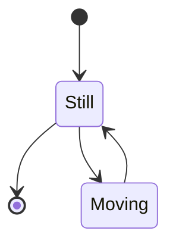
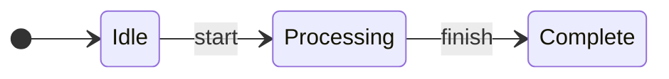
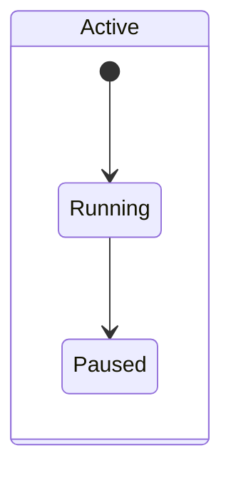

# Specification 001: State Diagram Width and Height Estimation

**Category**: foundation
**Priority**: high
**Status**: draft
**Dependencies**: None

## Context

Mermaid state diagrams (`stateDiagram` and `stateDiagram-v2`) are commonly used in documentation to visualize state machines, workflow states, and system transitions. Like flowcharts, state diagrams can grow large and exceed viewport constraints, making them difficult to read when auto-scaled.

Currently, mermaid-sonar only supports `flowchart` and `graph` diagram types. State diagrams are marked as `'unknown'` and receive no width/height estimation or viewport constraint checking. However, state diagrams use similar node-and-edge layouts to flowcharts, making them excellent candidates for the same analysis techniques.

State diagrams support layout directions (LR, RL, TD, TB) just like flowcharts, and suffer from the same readability issues when they become too wide or too tall for the viewport.

## Objective

Add complete support for Mermaid state diagrams, enabling accurate width and height estimation, viewport constraint validation, and layout recommendations for both `stateDiagram` and `stateDiagram-v2` syntax.

## Requirements

### Functional Requirements

1. **Diagram Type Detection**
   - Detect `stateDiagram` syntax (v1)
   - Detect `stateDiagram-v2` syntax (v2)
   - Add `'state'` type to DiagramType union
   - Correctly parse first line to identify state diagram type

2. **Layout Direction Detection**
   - Extract layout direction from state diagram syntax
   - Support: `direction LR`, `direction RL`, `direction TB`, `direction TD`
   - Default to TD when no direction specified
   - Handle both inline and block direction syntax

3. **Graph Structure Parsing**
   - Parse state transitions (e.g., `StateA --> StateB`)
   - Parse state definitions with labels
   - Handle composite states (nested states)
   - Parse choice pseudo-states (decision diamonds)
   - Handle fork/join nodes (parallel states)
   - Extract start state `[*]` and end states

4. **Width Estimation**
   - Use longest path algorithm for LR/RL layouts
   - Use max branch width for TD/TB layouts
   - Account for state label lengths
   - Handle multi-line state descriptions
   - Consider composite state nesting depth

5. **Height Estimation**
   - Use graph depth for TD/TB layouts
   - Use max branch width for LR/RL layouts
   - Account for state box heights
   - Consider nested state vertical space

6. **Rule Application**
   - Apply `horizontal-width-readability` rule to LR/RL state diagrams
   - Apply `vertical-height-readability` rule to TD/TB state diagrams
   - Apply `layout-hint` rule for sequential state patterns
   - Apply `max-branch-width` for wide state transitions

### Non-Functional Requirements

1. **Performance**: State diagram parsing should add <5ms overhead per diagram
2. **Compatibility**: Support both stateDiagram v1 and v2 syntax
3. **Accuracy**: Width/height estimates should be within 20% of actual rendered size
4. **Maintainability**: Reuse existing graph algorithms from flowchart implementation

## Acceptance Criteria

- [ ] DiagramType includes 'state' as a valid type
- [ ] detectDiagramType() correctly identifies stateDiagram and stateDiagram-v2
- [ ] State diagram parser extracts all states and transitions
- [ ] Layout direction detection works for all direction syntax variations
- [ ] Width estimation for LR/RL state diagrams uses longest path algorithm
- [ ] Height estimation for TD/TB state diagrams uses graph depth calculation
- [ ] Composite states (nested states) are correctly parsed and measured
- [ ] Choice nodes and fork/join nodes are handled in graph structure
- [ ] Start state [*] and end states are correctly identified
- [ ] All viewport readability rules apply to state diagrams
- [ ] Tests cover both stateDiagram v1 and v2 syntax
- [ ] Tests include state diagrams with various layout directions
- [ ] Documentation includes state diagram examples
- [ ] Integration tests verify state diagrams from real-world examples

## Technical Details

### Implementation Approach

1. **Type System Extension**
   ```typescript
   // src/extractors/types.ts
   export type DiagramType = 'flowchart' | 'graph' | 'state' | 'unknown';
   ```

2. **Detection Logic**
   ```typescript
   // src/extractors/markdown.ts
   function detectDiagramType(content: string): DiagramType {
     const firstLine = content.trim().split('\n')[0] || '';

     if (/^\s*stateDiagram(-v2)?/i.test(firstLine)) {
       return 'state';
     }
     // ... existing logic
   }
   ```

3. **Parser Extension**
   ```typescript
   // src/graph/state-parser.ts (new file)
   export function parseStateTransitions(content: string): GraphRepresentation {
     // Parse: StateA --> StateB
     // Parse: [*] --> StateA (start state)
     // Parse: StateA --> [*] (end state)
     // Parse: state StateA { ... } (composite states)
     // Parse: <<fork>> and <<join>> nodes
   }
   ```

4. **Layout Direction Extraction**
   ```typescript
   // src/rules/state-layout.ts
   function extractStateLayout(content: string): LayoutDirection {
     // Match: direction LR
     // Match: direction RL
     // Match: direction TD
     // Match: direction TB
     // Default: TD
   }
   ```

### Architecture Changes

- **New Module**: `src/graph/state-parser.ts` for state-specific parsing
- **Extended Type**: DiagramType union to include 'state'
- **Reuse**: Existing graph algorithms (calculateLongestPath, calculateMaxDepth)
- **Reuse**: Existing rules (horizontal-width-readability, vertical-height-readability)

### Data Structures

State diagram parsing produces the same `GraphRepresentation` structure:
```typescript
interface GraphRepresentation {
  nodes: string[];
  adjacencyList: Map<string, string[]>;
  reverseAdjacencyList: Map<string, string[]>;
}
```

Additional metadata for composite states (optional enhancement):
```typescript
interface StateMetadata {
  isComposite: boolean;
  nestedStates?: string[];
  depth: number;
}
```

### APIs and Interfaces

No breaking changes. State diagrams integrate seamlessly:
```typescript
// Existing API continues to work
const diagrams = extractDiagramsFromFile('docs/state-machine.md');
const results = await analyzeDiagrams(diagrams);
// State diagrams now included in results
```

## Dependencies

- **Prerequisites**: None (foundation specification)
- **Affected Components**:
  - `src/extractors/types.ts` - Add 'state' type
  - `src/extractors/markdown.ts` - Add state diagram detection
  - `src/graph/adjacency.ts` - Extend buildGraph() for state syntax
  - `src/rules/horizontal-width-readability.ts` - Support 'state' type
  - `src/rules/vertical-height-readability.ts` - Support 'state' type

- **External Dependencies**: None (uses existing Mermaid syntax knowledge)

## Testing Strategy

### Unit Tests

```typescript
// tests/unit/state-diagram.test.ts
describe('State Diagram Support', () => {
  it('should detect stateDiagram v1 syntax', () => {
    const content = 'stateDiagram\n  [*] --> Still';
    expect(detectDiagramType(content)).toBe('state');
  });

  it('should detect stateDiagram-v2 syntax', () => {
    const content = 'stateDiagram-v2\n  [*] --> Idle';
    expect(detectDiagramType(content)).toBe('state');
  });

  it('should parse state transitions', () => {
    const diagram = { content: 'stateDiagram\n  A --> B\n  B --> C', ... };
    const graph = buildGraph(diagram);
    expect(graph.nodes).toContain('A');
    expect(graph.nodes).toContain('B');
  });

  it('should detect LR layout direction', () => {
    const content = 'stateDiagram-v2\n  direction LR\n  A --> B';
    const layout = detectLayout(content);
    expect(layout).toBe('LR');
  });
});
```

### Integration Tests

```typescript
// tests/integration/state-diagram.test.ts
it('should catch wide LR state diagrams', async () => {
  const results = await analyzeDiagramFile('fixtures/wide-state-diagram.md');
  const widthIssue = results.issues.find(i => i.rule === 'horizontal-width-readability');
  expect(widthIssue).toBeDefined();
  expect(widthIssue?.message).toContain('state diagram');
});
```

### Fixtures

Create test fixtures:
- `tests/fixtures/state-diagram-simple.md` - Basic state diagram
- `tests/fixtures/state-diagram-wide-lr.md` - Wide LR layout
- `tests/fixtures/state-diagram-deep-td.md` - Deep TD layout
- `tests/fixtures/state-diagram-composite.md` - Nested states
- `tests/fixtures/state-diagram-v2.md` - stateDiagram-v2 syntax

### Real-World Validation

Test against state diagrams from actual documentation:
- AWS state machine examples
- Workflow state diagrams from popular repos
- State machine documentation from technical docs

## Documentation Requirements

### Code Documentation

- JSDoc comments for parseStateTransitions()
- Inline comments explaining v1 vs v2 syntax differences
- Examples of supported state diagram patterns

### User Documentation

Update README.md:
```markdown
## Supported Diagram Types

- ✅ Flowcharts (`flowchart` and `graph`)
- ✅ State Diagrams (`stateDiagram` and `stateDiagram-v2`)
- ⏳ Class Diagrams (coming soon)
- ⏳ Sequence Diagrams (coming soon)
```

Add examples:
```markdown
### State Diagram Example

**Problematic state diagram (too wide for mobile):**
\`\`\`mermaid
stateDiagram-v2
    direction LR
    [*] --> Idle
    Idle --> Processing
    Processing --> Validating
    Validating --> Approved
    Approved --> Complete
    Complete --> [*]
\`\`\`

**Mermaid-sonar detection:**
\`\`\`
❌ docs/workflow.md:10
   Diagram width (1200px) exceeds viewport limit
   → Consider using TD layout for better vertical scrolling
\`\`\`
```

### Architecture Updates

Update ARCHITECTURE.md (if it exists) with state diagram parsing flow.

## Implementation Notes

### State Diagram Syntax Variations

**stateDiagram v1**:


**stateDiagram-v2**:


**Composite States (v2 only)**:


### Edge Cases to Handle

1. **Start/End States**: `[*]` should not be counted as regular nodes
2. **Composite States**: Nested states add depth, need special handling
3. **Choice Nodes**: `<<choice>>` syntax creates decision points
4. **Fork/Join**: Parallel state syntax for concurrent states
5. **Notes**: `note left of StateA` should not affect graph structure

### Reuse Strategy

Maximize code reuse from flowchart implementation:
- ✅ Use same `buildGraph()` after parsing transitions
- ✅ Use same `calculateLongestPath()` for width
- ✅ Use same `calculateMaxDepth()` for height
- ✅ Use same rule evaluation logic
- ⚠️ Add state-specific transition parsing

### Performance Considerations

State diagrams are typically smaller than flowcharts:
- Average: 5-15 states
- Large: 20-30 states
- Parser overhead should be <2ms for typical diagrams

## Migration and Compatibility

### Breaking Changes

None. This is purely additive functionality.

### Backward Compatibility

- Existing flowchart/graph analysis unchanged
- 'unknown' diagram type behavior unchanged
- All existing rules continue to work

### Migration Path

Users get state diagram support automatically:
1. Upgrade to new version
2. Run `mermaid-sonar docs/`
3. State diagrams now analyzed alongside flowcharts

No configuration changes needed.

## Success Metrics

- State diagrams correctly identified (100% of test cases)
- Width/height estimates within 20% of actual rendered size
- No false positives on valid, readable state diagrams
- No performance regression (<5ms added per state diagram)
- User feedback: state diagram analysis is helpful

## Future Enhancements

After initial implementation, consider:
1. Composite state depth analysis
2. Parallel state width calculation
3. State-specific layout recommendations
4. Custom thresholds for state diagram complexity
