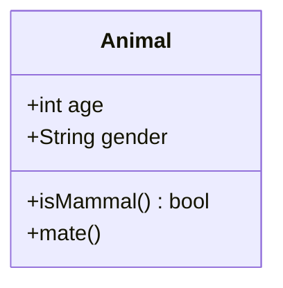
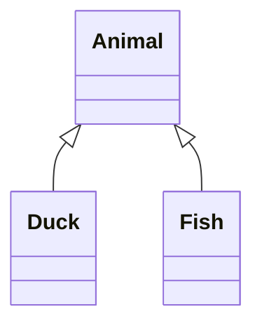
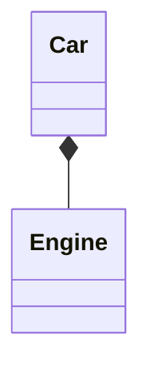
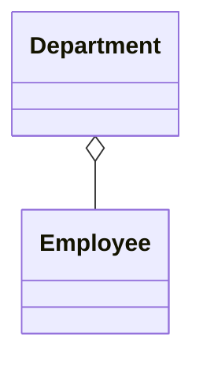
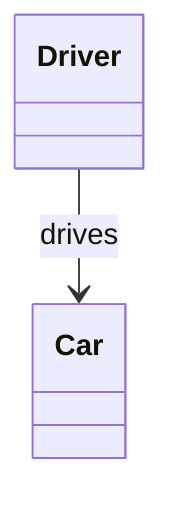
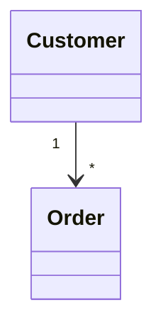

# Specification 002: Class Diagram Width and Height Estimation

**Category**: foundation
**Priority**: high
**Status**: draft
**Dependencies**: None

## Context

Mermaid class diagrams are extensively used in software documentation to visualize object-oriented designs, inheritance hierarchies, and relationships between classes. Class diagrams can become extremely wide when showing complex inheritance trees or many related classes horizontally.

Unlike flowcharts which have explicit flow direction, class diagrams use automatic layout algorithms that position classes based on relationships. However, diagrams with many classes side-by-side create significant horizontal width issues, especially in documentation frameworks with narrow content areas (e.g., MkDocs at 800px).

Currently, mermaid-sonar marks class diagrams as `'unknown'` and provides no viewport analysis. This leaves documentation authors unaware when their class diagrams will be auto-scaled to unreadable sizes.

## Objective

Add support for Mermaid class diagrams, enabling width and height estimation based on class count, relationship complexity, and inheritance depth. Provide actionable recommendations for restructuring overly complex class diagrams.

## Requirements

### Functional Requirements

1. **Diagram Type Detection**
   - Detect `classDiagram` syntax
   - Add `'class'` type to DiagramType union
   - Correctly parse first line to identify class diagram

2. **Class Structure Parsing**
   - Parse class definitions: `class ClassName`
   - Parse class members: attributes and methods
   - Parse inheritance: `ClassA <|-- ClassB`
   - Parse composition: `ClassA *-- ClassB`
   - Parse aggregation: `ClassA o-- ClassB`
   - Parse association: `ClassA --> ClassB`
   - Parse dependency: `ClassA ..> ClassB`
   - Parse multiplicity: `ClassA "1" --> "many" ClassB`

3. **Layout Analysis**
   - Calculate horizontal spread (classes at same inheritance level)
   - Calculate inheritance depth (levels in hierarchy)
   - Identify clusters of related classes
   - Detect wide relationship patterns

4. **Width Estimation**
   - Base width on class count and class name lengths
   - Account for horizontal class distribution
   - Consider relationship arrow space
   - Factor in method/attribute label lengths
   - Estimate: `width = maxClassesPerLevel * (avgClassWidth + spacing)`

5. **Height Estimation**
   - Base height on inheritance depth
   - Account for class box heights (number of members)
   - Consider vertical spacing between levels
   - Estimate: `height = inheritanceDepth * (maxClassHeight + spacing)`

6. **Complexity Metrics**
   - Count total classes
   - Measure relationship density
   - Calculate inheritance depth
   - Identify widest horizontal level

### Non-Functional Requirements

1. **Performance**: Class diagram parsing should add <10ms overhead per diagram
2. **Accuracy**: Width estimates within 30% of actual rendered size (class layout is less predictable)
3. **Scalability**: Handle diagrams with up to 50 classes efficiently
4. **Maintainability**: Use consistent parsing patterns with other diagram types

## Acceptance Criteria

- [ ] DiagramType includes 'class' as a valid type
- [ ] detectDiagramType() correctly identifies classDiagram
- [ ] Parser extracts all class definitions and relationships
- [ ] All relationship types are parsed (inheritance, composition, association, etc.)
- [ ] Width estimation accounts for horizontal class distribution
- [ ] Height estimation accounts for inheritance depth
- [ ] Class member count affects height calculation
- [ ] Relationship multiplicity is parsed correctly
- [ ] Generic/template classes are handled
- [ ] Namespace/package syntax is parsed
- [ ] Rules trigger for overly wide class diagrams
- [ ] Suggestions recommend splitting into multiple diagrams
- [ ] Tests cover various class diagram patterns
- [ ] Real-world class diagram examples validate accuracy
- [ ] Documentation includes class diagram analysis examples

## Technical Details

### Implementation Approach

1. **Type System Extension**
   ```typescript
   // src/extractors/types.ts
   export type DiagramType = 'flowchart' | 'graph' | 'state' | 'class' | 'unknown';
   ```

2. **Detection Logic**
   ```typescript
   // src/extractors/markdown.ts
   function detectDiagramType(content: string): DiagramType {
     const firstLine = content.trim().split('\n')[0] || '';

     if (/^\s*classDiagram/i.test(firstLine)) {
       return 'class';
     }
     // ... existing logic
   }
   ```

3. **Class Diagram Parser**
   ```typescript
   // src/graph/class-parser.ts (new file)
   interface ClassNode {
     name: string;
     attributes: string[];
     methods: string[];
   }

   interface ClassRelationship {
     from: string;
     to: string;
     type: 'inheritance' | 'composition' | 'aggregation' | 'association' | 'dependency';
     label?: string;
   }

   export function parseClassDiagram(content: string): {
     classes: Map<string, ClassNode>;
     relationships: ClassRelationship[];
     graph: GraphRepresentation;
   }
   ```

4. **Width Calculation**
   ```typescript
   function estimateClassDiagramWidth(analysis: ClassAnalysis): number {
     // Find widest level in inheritance hierarchy
     const maxClassesPerLevel = Math.max(...analysis.levelWidths);

     // Average class box width based on name + longest member
     const avgClassWidth = calculateAvgClassWidth(analysis.classes);

     // Spacing between classes
     const classSpacing = 100; // pixels

     return maxClassesPerLevel * (avgClassWidth + classSpacing);
   }
   ```

5. **Height Calculation**
   ```typescript
   function estimateClassDiagramHeight(analysis: ClassAnalysis): number {
     const inheritanceDepth = analysis.maxInheritanceDepth;

     // Class box height varies by member count
     const avgClassHeight = calculateAvgClassHeight(analysis.classes);

     // Vertical spacing between levels
     const levelSpacing = 80; // pixels

     return inheritanceDepth * (avgClassHeight + levelSpacing);
   }
   ```

### Architecture Changes

- **New Module**: `src/graph/class-parser.ts` for class-specific parsing
- **New Module**: `src/analyzers/class-analyzer.ts` for class-specific metrics
- **Extended Type**: DiagramType union to include 'class'
- **New Rule**: `class-diagram-width` for class-specific width analysis

### Data Structures

```typescript
interface ClassAnalysis {
  classes: Map<string, ClassNode>;
  relationships: ClassRelationship[];
  levelWidths: number[];  // Classes per inheritance level
  maxInheritanceDepth: number;
  relationshipDensity: number;  // relationships / classes
  avgClassWidth: number;
  avgClassHeight: number;
}
```

### APIs and Interfaces

New rule for class diagrams:
```typescript
// src/rules/class-diagram-width.ts
export const classDiagramWidthRule: Rule = {
  name: 'class-diagram-width',
  defaultSeverity: 'warning',

  check(diagram: Diagram, metrics: Metrics, config: RuleConfig): Issue | null {
    if (diagram.type !== 'class') return null;

    const analysis = analyzeClassDiagram(diagram);
    const width = estimateClassDiagramWidth(analysis);

    // Apply viewport thresholds
    // ...
  }
};
```

## Dependencies

- **Prerequisites**: None (foundation specification)
- **Affected Components**:
  - `src/extractors/types.ts` - Add 'class' type
  - `src/extractors/markdown.ts` - Add class diagram detection
  - `src/graph/class-parser.ts` - New file
  - `src/analyzers/class-analyzer.ts` - New file
  - `src/rules/class-diagram-width.ts` - New rule
  - `src/rules/index.ts` - Register new rule

- **External Dependencies**: None

## Testing Strategy

### Unit Tests

```typescript
// tests/unit/class-diagram.test.ts
describe('Class Diagram Support', () => {
  it('should detect classDiagram syntax', () => {
    const content = 'classDiagram\n  class Animal';
    expect(detectDiagramType(content)).toBe('class');
  });

  it('should parse class definitions', () => {
    const diagram = {
      content: 'classDiagram\n  class Dog\n  Dog : +bark()',
      type: 'class',
      ...
    };
    const analysis = analyzeClassDiagram(diagram);
    expect(analysis.classes.has('Dog')).toBe(true);
    expect(analysis.classes.get('Dog')?.methods).toContain('bark()');
  });

  it('should parse inheritance relationships', () => {
    const content = 'classDiagram\n  Animal <|-- Dog';
    const analysis = parseClassDiagram(content);
    expect(analysis.relationships).toContainEqual({
      from: 'Dog',
      to: 'Animal',
      type: 'inheritance'
    });
  });

  it('should calculate inheritance depth', () => {
    const content = `classDiagram
      Animal <|-- Mammal
      Mammal <|-- Dog
      Dog <|-- Poodle`;
    const analysis = analyzeClassDiagram(...);
    expect(analysis.maxInheritanceDepth).toBe(4);
  });
});
```

### Integration Tests

```typescript
// tests/integration/class-diagram.test.ts
it('should catch wide class diagrams', async () => {
  const results = await analyzeDiagramFile('fixtures/wide-class-diagram.md');
  const widthIssue = results.issues.find(i => i.rule === 'class-diagram-width');
  expect(widthIssue).toBeDefined();
});
```

### Test Fixtures

- `tests/fixtures/class-diagram-simple.md` - Basic inheritance
- `tests/fixtures/class-diagram-wide.md` - Many classes horizontally
- `tests/fixtures/class-diagram-deep.md` - Deep inheritance hierarchy
- `tests/fixtures/class-diagram-complex.md` - Multiple relationship types
- `tests/fixtures/class-diagram-members.md` - Classes with many members

### Real-World Examples

Test against real class diagrams:
- Design pattern examples (Factory, Observer, Strategy)
- ORM model diagrams
- Domain model diagrams from popular frameworks

## Documentation Requirements

### Code Documentation

- Document class diagram syntax variations
- Explain inheritance depth calculation
- Provide examples of relationship type parsing

### User Documentation

Update README.md:
```markdown
### Class Diagram Example

**Problematic class diagram (too wide):**
\`\`\`mermaid
classDiagram
    Animal <|-- Mammal
    Animal <|-- Bird
    Animal <|-- Fish
    Mammal <|-- Dog
    Mammal <|-- Cat
    Mammal <|-- Horse
    Bird <|-- Eagle
    Bird <|-- Penguin
    Fish <|-- Shark
\`\`\`

**Mermaid-sonar detection:**
\`\`\`
⚠️  docs/domain-model.md:15
   Class diagram width (1400px) exceeds viewport limit
   9 classes across 3 inheritance levels
   → Split into separate diagrams by domain (Mammals, Birds, Fish)
\`\`\`
```

### Architecture Updates

Document class diagram parsing in architecture docs.

## Implementation Notes

### Class Diagram Syntax Patterns

**Basic Class**:


**Inheritance**:


**Composition** (strong ownership):


**Aggregation** (weak ownership):


**Association**:


**Multiplicity**:


### Width Estimation Strategy

Key insight: Class diagrams layout classes horizontally at each inheritance level.

Example:
```
        Animal
       /  |   \
    Dog  Cat  Bird  ← 3 classes wide at level 2
     |    |    |
  Poodle Persian Eagle
```

Width = `max(classesPerLevel) * (avgClassWidth + spacing)`

### Edge Cases

1. **Diamond Inheritance**: Multiple inheritance paths
2. **Circular References**: Association cycles (shouldn't happen in good design)
3. **Generic Classes**: `List~String~` syntax
4. **Namespaces**: `namespace Banking { class Account }`
5. **Interfaces**: Different symbol than classes
6. **Abstract Classes**: Different styling
7. **Visibility**: `+public`, `-private`, `#protected`, `~package`

### Layout Heuristics

Mermaid uses Dagre layout engine for class diagrams:
- Classes at same inheritance level typically horizontal
- Inheritance relationships prefer vertical layout
- Association/composition can go any direction
- Width dominated by widest inheritance level

### Complexity Thresholds

Recommended thresholds:
- **Warning**: >8 classes per inheritance level
- **Error**: >12 classes per inheritance level
- **Info**: Inheritance depth > 4 levels
- **Warning**: Relationship density > 3 (avg relationships per class)

## Migration and Compatibility

### Breaking Changes

None. Purely additive functionality.

### Backward Compatibility

All existing diagram type analysis unchanged.

### Migration Path

Automatic - users get class diagram support on upgrade.

## Success Metrics

- Class diagrams correctly identified (100% of test cases)
- Width estimates identify 90%+ of diagrams that render too wide
- Suggestions help users restructure complex diagrams
- No performance regression

## Future Enhancements

1. **Namespace Analysis**: Group classes by namespace/package
2. **Pattern Detection**: Identify design patterns in class structure
3. **Coupling Metrics**: Measure class coupling and cohesion
4. **Custom Thresholds**: Per-project class diagram limits
5. **Auto-Split Suggestions**: Recommend specific diagram splits by domain
