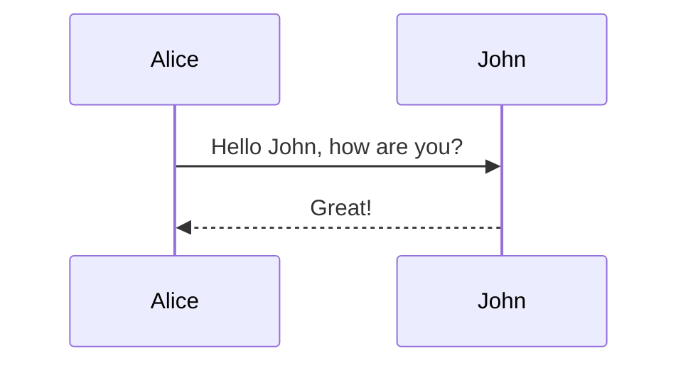
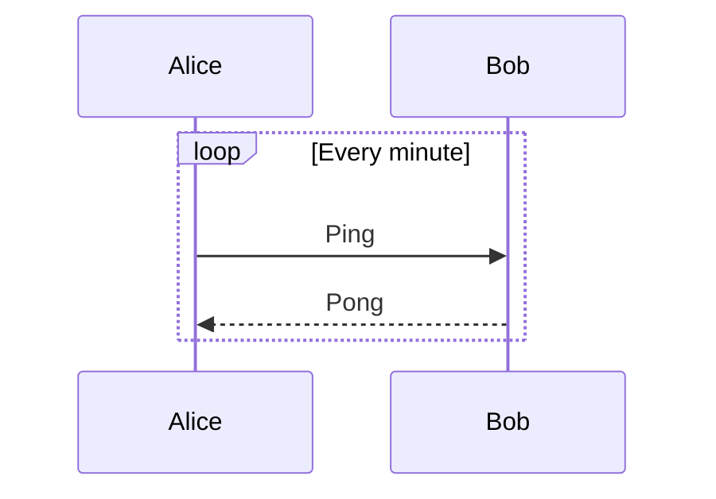
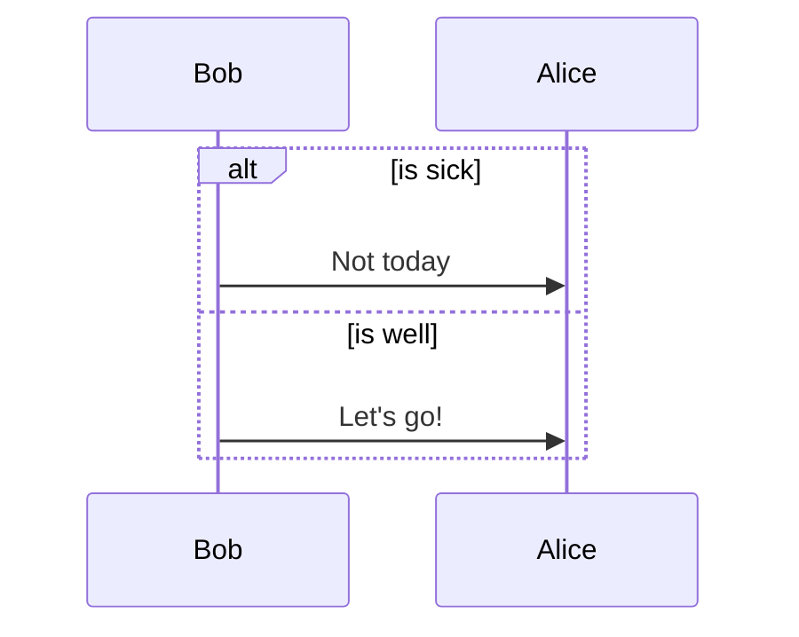
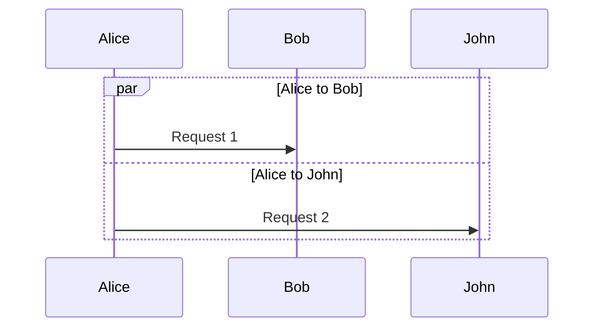

# Specification 003: Sequence Diagram Width and Height Estimation

**Category**: foundation
**Priority**: medium
**Status**: draft
**Dependencies**: None

## Context

Mermaid sequence diagrams visualize interactions between actors/objects over time. They are commonly used in API documentation, system design docs, and technical specifications to show message flow between components.

Sequence diagrams have unique layout characteristics:
- **Horizontal growth**: More participants → wider diagram
- **Vertical growth**: More messages/interactions → taller diagram
- **No explicit layout direction**: Always participants across top, messages flow downward

Unlike flowcharts with branching paths, sequence diagrams are strictly linear in time (top to bottom), but can become excessively wide with many participants or tall with many message exchanges.

Currently marked as `'unknown'`, sequence diagrams receive no viewport analysis, leading to unreadable auto-scaled diagrams in narrow documentation viewports.

## Objective

Add support for Mermaid sequence diagrams, enabling width estimation based on participant count and height estimation based on message count. Provide recommendations for splitting long sequences or reducing participant count.

## Requirements

### Functional Requirements

1. **Diagram Type Detection**
   - Detect `sequenceDiagram` syntax
   - Add `'sequence'` type to DiagramType union
   - Correctly parse first line

2. **Participant Parsing**
   - Parse explicit participants: `participant Alice`
   - Parse actors: `actor Bob`
   - Detect implicit participants from messages
   - Parse aliases: `participant A as Alice`
   - Parse participant groups: `box "Group Name"`

3. **Message Parsing**
   - Parse synchronous messages: `Alice->>Bob: Message`
   - Parse asynchronous messages: `Alice-)Bob: Message`
   - Parse return messages: `Bob-->>Alice: Response`
   - Parse activation boxes: `activate Alice`
   - Parse loops: `loop Every minute`
   - Parse alt/else: `alt Condition`
   - Parse par (parallel): `par Thread 1`
   - Parse notes: `Note left of Alice`

4. **Width Estimation**
   - Base width on participant count
   - Account for participant label lengths
   - Consider activation box widths
   - Formula: `width = participantCount * (labelWidth + spacing)`
   - Typical participant spacing: 200-250px

5. **Height Estimation**
   - Count total messages/interactions
   - Account for loop/alt block heights
   - Consider note box heights
   - Formula: `height = messageCount * messageHeight + blockOverhead`
   - Typical message height: 40-60px

6. **Complexity Metrics**
   - Total participant count
   - Total message count
   - Nesting depth (loops within alts, etc.)
   - Longest activation chain

### Non-Functional Requirements

1. **Performance**: Sequence diagram parsing <8ms per diagram
2. **Accuracy**: Width estimates within 25% of actual rendered size
3. **Scalability**: Handle diagrams with up to 20 participants, 100 messages
4. **Maintainability**: Clear separation between width/height estimation logic

## Acceptance Criteria

- [ ] DiagramType includes 'sequence' as a valid type
- [ ] detectDiagramType() correctly identifies sequenceDiagram
- [ ] Parser extracts all participants (explicit and implicit)
- [ ] Parser counts all message types
- [ ] Parser detects participant groups/boxes
- [ ] Width estimation accounts for participant count and label lengths
- [ ] Height estimation accounts for message count and nested blocks
- [ ] Loop/alt/par blocks correctly affect height
- [ ] Rules trigger for overly wide sequence diagrams (>6 participants)
- [ ] Rules trigger for overly tall sequence diagrams (>30 messages)
- [ ] Suggestions recommend splitting by logical phases
- [ ] Tests cover various sequence diagram patterns
- [ ] Real-world sequence diagrams validate estimates
- [ ] Documentation includes sequence diagram examples

## Technical Details

### Implementation Approach

1. **Type System Extension**
   ```typescript
   // src/extractors/types.ts
   export type DiagramType =
     'flowchart' | 'graph' | 'state' | 'class' | 'sequence' | 'unknown';
   ```

2. **Detection Logic**
   ```typescript
   // src/extractors/markdown.ts
   function detectDiagramType(content: string): DiagramType {
     const firstLine = content.trim().split('\n')[0] || '';

     if (/^\s*sequenceDiagram/i.test(firstLine)) {
       return 'sequence';
     }
     // ... existing logic
   }
   ```

3. **Sequence Diagram Parser**
   ```typescript
   // src/graph/sequence-parser.ts (new file)
   interface Participant {
     id: string;
     label: string;
     type: 'participant' | 'actor';
   }

   interface Message {
     from: string;
     to: string;
     type: 'sync' | 'async' | 'return';
     label: string;
   }

   interface SequenceAnalysis {
     participants: Map<string, Participant>;
     messages: Message[];
     messageCount: number;
     nestingDepth: number;
     hasLoops: boolean;
     hasAlts: boolean;
     hasPar: boolean;
   }

   export function parseSequenceDiagram(content: string): SequenceAnalysis
   ```

4. **Width Calculation**
   ```typescript
   function estimateSequenceWidth(analysis: SequenceAnalysis): number {
     const participantCount = analysis.participants.size;

     // Measure participant label widths
     const avgLabelWidth = calculateAvgLabelWidth(analysis.participants);

     // Mermaid sequence spacing: ~200px per participant
     const participantSpacing = 200;

     // Box overhead for groups
     const groupOverhead = analysis.hasGroups ? 50 : 0;

     return participantCount * participantSpacing + groupOverhead;
   }
   ```

5. **Height Calculation**
   ```typescript
   function estimateSequenceHeight(analysis: SequenceAnalysis): number {
     const messageHeight = 50; // pixels per message
     const loopOverhead = 80; // extra height for loop blocks
     const altOverhead = 60; // extra height for alt blocks

     let height = analysis.messageCount * messageHeight;

     // Add overhead for nested blocks
     if (analysis.hasLoops) height += loopOverhead;
     if (analysis.hasAlts) height += altOverhead;
     if (analysis.hasPar) height += 70;

     // Add overhead for nesting
     height += analysis.nestingDepth * 40;

     return height;
   }
   ```

### Architecture Changes

- **New Module**: `src/graph/sequence-parser.ts`
- **New Module**: `src/analyzers/sequence-analyzer.ts`
- **New Rule**: `sequence-diagram-width` for participant count
- **New Rule**: `sequence-diagram-height` for message count

### Data Structures

```typescript
interface SequenceAnalysis {
  participants: Map<string, Participant>;
  messages: Message[];
  messageCount: number;
  participantCount: number;
  nestingDepth: number;
  loops: number;
  alts: number;
  pars: number;
  avgLabelWidth: number;
  estimatedWidth: number;
  estimatedHeight: number;
}
```

### APIs and Interfaces

```typescript
// src/rules/sequence-diagram-width.ts
export const sequenceDiagramWidthRule: Rule = {
  name: 'sequence-diagram-width',
  defaultSeverity: 'warning',

  check(diagram: Diagram, metrics: Metrics, config: RuleConfig): Issue | null {
    if (diagram.type !== 'sequence') return null;

    const analysis = analyzeSequenceDiagram(diagram);

    // Warn if >6 participants (viewport width concerns)
    if (analysis.participantCount > 6) {
      return {
        rule: this.name,
        severity: 'warning',
        message: `Sequence diagram has ${analysis.participantCount} participants, may be too wide`,
        suggestion: 'Consider splitting into multiple sequence diagrams by functional area',
        ...
      };
    }

    return null;
  }
};
```

## Dependencies

- **Prerequisites**: None
- **Affected Components**:
  - `src/extractors/types.ts` - Add 'sequence' type
  - `src/extractors/markdown.ts` - Add detection
  - `src/graph/sequence-parser.ts` - New file
  - `src/analyzers/sequence-analyzer.ts` - New file
  - `src/rules/sequence-diagram-width.ts` - New rule
  - `src/rules/sequence-diagram-height.ts` - New rule
  - `src/rules/index.ts` - Register new rules

- **External Dependencies**: None

## Testing Strategy

### Unit Tests

```typescript
// tests/unit/sequence-diagram.test.ts
describe('Sequence Diagram Support', () => {
  it('should detect sequenceDiagram syntax', () => {
    const content = 'sequenceDiagram\n  Alice->>Bob: Hello';
    expect(detectDiagramType(content)).toBe('sequence');
  });

  it('should parse explicit participants', () => {
    const content = `sequenceDiagram
      participant Alice
      participant Bob`;
    const analysis = parseSequenceDiagram(content);
    expect(analysis.participants.size).toBe(2);
  });

  it('should detect implicit participants from messages', () => {
    const content = 'sequenceDiagram\n  Alice->>Bob: Hi';
    const analysis = parseSequenceDiagram(content);
    expect(analysis.participants.has('Alice')).toBe(true);
    expect(analysis.participants.has('Bob')).toBe(true);
  });

  it('should count messages correctly', () => {
    const content = `sequenceDiagram
      Alice->>Bob: Request
      Bob-->>Alice: Response`;
    const analysis = parseSequenceDiagram(content);
    expect(analysis.messageCount).toBe(2);
  });

  it('should detect loops and alts', () => {
    const content = `sequenceDiagram
      loop Every second
        Alice->>Bob: Ping
      end
      alt Success
        Bob-->>Alice: Pong
      else Failure
        Bob-->>Alice: Error
      end`;
    const analysis = parseSequenceDiagram(content);
    expect(analysis.hasLoops).toBe(true);
    expect(analysis.hasAlts).toBe(true);
  });

  it('should calculate nesting depth', () => {
    const content = `sequenceDiagram
      loop Outer
        alt Condition
          loop Inner
            Alice->>Bob: Message
          end
        end
      end`;
    const analysis = parseSequenceDiagram(content);
    expect(analysis.nestingDepth).toBe(3);
  });
});
```

### Integration Tests

```typescript
// tests/integration/sequence-diagram.test.ts
it('should warn on wide sequence diagrams', async () => {
  const results = await analyzeDiagramFile('fixtures/wide-sequence.md');
  const widthIssue = results.issues.find(i =>
    i.rule === 'sequence-diagram-width'
  );
  expect(widthIssue).toBeDefined();
  expect(widthIssue?.message).toContain('participants');
});

it('should warn on tall sequence diagrams', async () => {
  const results = await analyzeDiagramFile('fixtures/long-sequence.md');
  const heightIssue = results.issues.find(i =>
    i.rule === 'sequence-diagram-height'
  );
  expect(heightIssue).toBeDefined();
  expect(heightIssue?.message).toContain('messages');
});
```

### Test Fixtures

- `tests/fixtures/sequence-simple.md` - Basic 2-3 participant diagram
- `tests/fixtures/sequence-wide.md` - 8+ participants
- `tests/fixtures/sequence-long.md` - 40+ messages
- `tests/fixtures/sequence-nested.md` - Deep loop/alt nesting
- `tests/fixtures/sequence-groups.md` - Participant boxes

### Real-World Examples

- API authentication flows
- Microservice interaction diagrams
- Database transaction sequences
- WebSocket message exchanges

## Documentation Requirements

### Code Documentation

- Document sequence diagram syntax patterns
- Explain participant detection (explicit vs implicit)
- Provide examples of message type parsing

### User Documentation

Update README.md:
```markdown
### Sequence Diagram Example

**Problematic sequence diagram (too many participants):**
\`\`\`mermaid
sequenceDiagram
    participant User
    participant Frontend
    participant Gateway
    participant Auth
    participant UserService
    participant Database
    participant Cache
    participant Logger
    User->>Frontend: Login
    Frontend->>Gateway: POST /login
    ...
\`\`\`

**Mermaid-sonar detection:**
\`\`\`
⚠️  docs/api-flow.md:20
   Sequence diagram has 8 participants (>6 recommended)
   Estimated width: 1600px exceeds viewport
   → Split into diagrams: Client Flow, Backend Services, Data Layer
\`\`\`
```

## Implementation Notes

### Sequence Diagram Syntax Patterns

**Basic Messages**:


**Message Types**:
- `->` Solid line without arrow
- `-->` Dotted line without arrow
- `->>` Solid line with arrowhead
- `-->>` Dotted line with arrowhead
- `-x` Solid line with cross (async)
- `--x` Dotted line with cross
- `-)` Solid line with open arrow (async)
- `--)` Dotted line with open arrow

**Loops**:


**Conditional (Alt/Else)**:


**Parallel (Par)**:


### Width Estimation Key Insight

Sequence diagram width is primarily determined by:
1. Number of participants (most significant factor)
2. Length of participant names
3. Presence of participant boxes/groups

Formula: `width ≈ participantCount × 200px`

Thresholds:
- Mobile (400px): 2 participants max
- MkDocs (800px): 4 participants max
- Standard (1200px): 6 participants max

### Height Estimation Key Insight

Sequence diagram height grows linearly with messages:
1. Base message height: ~50px
2. Loop blocks add overhead: ~80px
3. Alt blocks add overhead: ~60px
4. Nesting adds: ~40px per level

Typical diagrams:
- Short: 5-10 messages (~500px)
- Medium: 15-25 messages (~1000px)
- Long: 30+ messages (~1500px+)

### Edge Cases

1. **Self-messages**: `Alice->>Alice: Self-call`
2. **Numbered messages**: `autonumber` directive
3. **Participant aliases**: `participant A as Alice`
4. **Boxes/Groups**: `box "Group Name"`
5. **Activation**: `activate Alice` / `deactivate Alice`
6. **Notes**: `Note left of Alice`, `Note over Alice,Bob`
7. **Critical sections**: `critical`, `break`, `opt`

### Complexity Thresholds

Recommended limits:
- **Participants**:
  - Info: >4 participants
  - Warning: >6 participants
  - Error: >8 participants

- **Messages**:
  - Info: >20 messages
  - Warning: >30 messages
  - Error: >50 messages

- **Nesting**:
  - Warning: Depth >2
  - Error: Depth >3

## Migration and Compatibility

### Breaking Changes

None. Additive feature.

### Backward Compatibility

All existing diagram analysis unchanged.

### Migration Path

Automatic on upgrade.

## Success Metrics

- Sequence diagrams correctly identified (100% of test cases)
- Width estimates identify 85%+ of too-wide diagrams
- Height estimates identify 85%+ of too-tall diagrams
- Suggestions help users restructure complex sequences
- No performance regression

## Future Enhancements

1. **Auto-split Recommendations**: Suggest logical split points
2. **Participant Grouping**: Recommend participant box organization
3. **Message Pattern Detection**: Identify request-response pairs
4. **Performance Analysis**: Detect potential performance bottlenecks in sequences
5. **Async Pattern Detection**: Identify fire-and-forget vs request-response patterns
