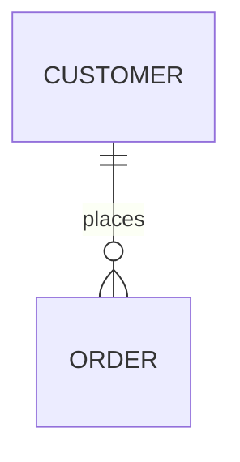
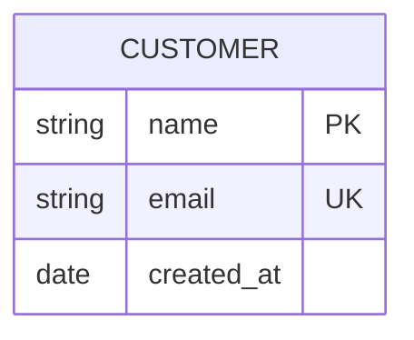
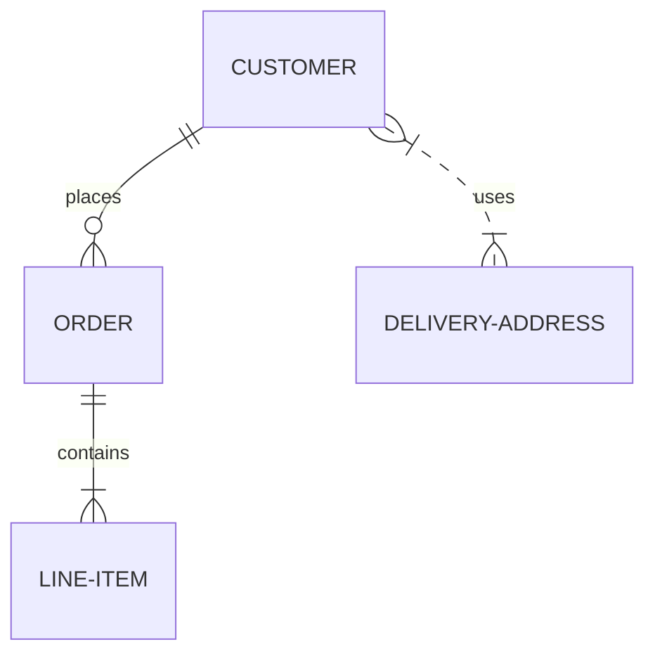

# Specification 004: Entity-Relationship Diagram Width and Height Estimation

**Category**: foundation
**Priority**: medium
**Status**: draft
**Dependencies**: None

## Context

Mermaid ER (Entity-Relationship) diagrams are used extensively in database design documentation to visualize table schemas, relationships, and cardinality between entities. They are fundamental to understanding data models in API documentation, architecture docs, and database migration guides.

ER diagrams can become very wide when showing complex data models with many entities and relationships. Similar to class diagrams, ER diagrams use automatic layout that positions entities based on their relationships, leading to unpredictable but often wide horizontal layouts.

Currently marked as `'unknown'`, ER diagrams receive no viewport analysis, causing readability issues when auto-scaled in narrow documentation viewports.

## Objective

Add support for Mermaid ER diagrams, enabling width and height estimation based on entity count, relationship complexity, and attribute lengths. Provide recommendations for restructuring overly complex ER diagrams by domain or functional area.

## Requirements

### Functional Requirements

1. **Diagram Type Detection**
   - Detect `erDiagram` syntax
   - Add `'er'` type to DiagramType union
   - Correctly parse first line

2. **Entity Parsing**
   - Parse entity definitions: `ENTITY_NAME`
   - Parse entity attributes: `ENTITY { type attribute }`
   - Parse attribute types and constraints
   - Detect primary keys and foreign keys
   - Handle multi-word entity names

3. **Relationship Parsing**
   - Parse relationship cardinality: `||`, `|o`, `o|`, `o{`, `}{`, `||`
   - Parse relationship types: `--`, `..`
   - Parse relationship labels
   - Parse bidirectional relationships
   - Map cardinality notation: one-to-one, one-to-many, many-to-many

4. **Width Estimation**
   - Base width on entity count and distribution
   - Account for relationship complexity
   - Consider attribute label lengths
   - Factor in entity box widths
   - Estimate: `width = sqrt(entityCount) * (avgEntityWidth + spacing)`

5. **Height Estimation**
   - Account for entity box heights (attribute count)
   - Consider vertical spacing
   - Estimate: `height = sqrt(entityCount) * (maxEntityHeight + spacing)`

6. **Complexity Metrics**
   - Total entity count
   - Total relationship count
   - Relationship density (relationships per entity)
   - Average attributes per entity
   - Maximum entity box size

### Non-Functional Requirements

1. **Performance**: ER diagram parsing <8ms per diagram
2. **Accuracy**: Width estimates within 30% of actual rendered size
3. **Scalability**: Handle diagrams with up to 30 entities efficiently
4. **Maintainability**: Clear parsing logic for different cardinality notations

## Acceptance Criteria

- [ ] DiagramType includes 'er' as a valid type
- [ ] detectDiagramType() correctly identifies erDiagram
- [ ] Parser extracts all entity definitions
- [ ] Parser extracts all entity attributes and types
- [ ] Parser identifies all relationship types and cardinalities
- [ ] Cardinality notation is correctly interpreted
- [ ] Width estimation accounts for entity distribution
- [ ] Height estimation accounts for entity box sizes
- [ ] Rules trigger for overly wide ER diagrams (>12 entities)
- [ ] Suggestions recommend splitting by domain
- [ ] Tests cover various ER diagram patterns
- [ ] Real-world database schema examples validate accuracy
- [ ] Documentation includes ER diagram analysis examples

## Technical Details

### Implementation Approach

1. **Type System Extension**
   ```typescript
   // src/extractors/types.ts
   export type DiagramType =
     'flowchart' | 'graph' | 'state' | 'class' | 'sequence' | 'er' | 'unknown';
   ```

2. **Detection Logic**
   ```typescript
   // src/extractors/markdown.ts
   function detectDiagramType(content: string): DiagramType {
     const firstLine = content.trim().split('\n')[0] || '';

     if (/^\s*erDiagram/i.test(firstLine)) {
       return 'er';
     }
     // ... existing logic
   }
   ```

3. **ER Diagram Parser**
   ```typescript
   // src/graph/er-parser.ts (new file)
   interface Entity {
     name: string;
     attributes: EntityAttribute[];
   }

   interface EntityAttribute {
     type: string;
     name: string;
     isPrimaryKey?: boolean;
     isForeignKey?: boolean;
   }

   interface Relationship {
     from: string;
     to: string;
     fromCardinality: Cardinality;
     toCardinality: Cardinality;
     label?: string;
     type: 'identifying' | 'non-identifying';
   }

   type Cardinality =
     | 'zero-or-one'    // |o
     | 'exactly-one'    // ||
     | 'zero-or-more'   // }o
     | 'one-or-more';   // }|

   interface ERAnalysis {
     entities: Map<string, Entity>;
     relationships: Relationship[];
     entityCount: number;
     relationshipCount: number;
     avgAttributesPerEntity: number;
     maxAttributeCount: number;
     relationshipDensity: number;
   }

   export function parseERDiagram(content: string): ERAnalysis
   ```

4. **Width Calculation**
   ```typescript
   function estimateERDiagramWidth(analysis: ERAnalysis): number {
     const entityCount = analysis.entityCount;

     // ER diagrams tend toward square-ish layouts
     // Approximate as sqrt(n) × sqrt(n) grid
     const entitiesPerRow = Math.ceil(Math.sqrt(entityCount));

     // Average entity box width
     const avgEntityWidth = calculateAvgEntityWidth(analysis.entities);

     // Horizontal spacing between entities
     const entitySpacing = 150; // pixels

     // Relationship arrows add width
     const relationshipOverhead = analysis.relationshipDensity * 50;

     return entitiesPerRow * (avgEntityWidth + entitySpacing) +
            relationshipOverhead;
   }
   ```

5. **Height Calculation**
   ```typescript
   function estimateERDiagramHeight(analysis: ERAnalysis): number {
     const entityCount = analysis.entityCount;
     const entitiesPerColumn = Math.ceil(Math.sqrt(entityCount));

     // Entity box height varies by attribute count
     const avgEntityHeight = calculateAvgEntityHeight(analysis.entities);

     // Vertical spacing
     const entitySpacing = 120; // pixels

     return entitiesPerColumn * (avgEntityHeight + entitySpacing);
   }
   ```

### Architecture Changes

- **New Module**: `src/graph/er-parser.ts`
- **New Module**: `src/analyzers/er-analyzer.ts`
- **New Rule**: `er-diagram-width` for entity count and layout

### Data Structures

```typescript
interface ERAnalysis {
  entities: Map<string, Entity>;
  relationships: Relationship[];
  entityCount: number;
  relationshipCount: number;
  avgAttributesPerEntity: number;
  maxAttributeCount: number;
  relationshipDensity: number; // relationships / entities
  estimatedWidth: number;
  estimatedHeight: number;
}
```

### APIs and Interfaces

```typescript
// src/rules/er-diagram-width.ts
export const erDiagramWidthRule: Rule = {
  name: 'er-diagram-width',
  defaultSeverity: 'warning',

  check(diagram: Diagram, metrics: Metrics, config: RuleConfig): Issue | null {
    if (diagram.type !== 'er') return null;

    const analysis = analyzeERDiagram(diagram);

    // Warn if >12 entities (width concerns)
    if (analysis.entityCount > 12) {
      return {
        rule: this.name,
        severity: 'warning',
        message: `ER diagram has ${analysis.entityCount} entities, likely too wide`,
        suggestion: 'Split into separate diagrams by domain (e.g., Users, Orders, Inventory)',
        ...
      };
    }

    return null;
  }
};
```

## Dependencies

- **Prerequisites**: None
- **Affected Components**:
  - `src/extractors/types.ts` - Add 'er' type
  - `src/extractors/markdown.ts` - Add detection
  - `src/graph/er-parser.ts` - New file
  - `src/analyzers/er-analyzer.ts` - New file
  - `src/rules/er-diagram-width.ts` - New rule
  - `src/rules/index.ts` - Register rule

- **External Dependencies**: None

## Testing Strategy

### Unit Tests

```typescript
// tests/unit/er-diagram.test.ts
describe('ER Diagram Support', () => {
  it('should detect erDiagram syntax', () => {
    const content = 'erDiagram\n  CUSTOMER ||--o{ ORDER : places';
    expect(detectDiagramType(content)).toBe('er');
  });

  it('should parse entity definitions', () => {
    const content = `erDiagram
      CUSTOMER {
        string name
        string email
      }`;
    const analysis = parseERDiagram(content);
    expect(analysis.entities.has('CUSTOMER')).toBe(true);
    expect(analysis.entities.get('CUSTOMER')?.attributes).toHaveLength(2);
  });

  it('should parse relationships with cardinality', () => {
    const content = 'erDiagram\n  CUSTOMER ||--o{ ORDER : places';
    const analysis = parseERDiagram(content);
    expect(analysis.relationships).toHaveLength(1);
    expect(analysis.relationships[0].fromCardinality).toBe('exactly-one');
    expect(analysis.relationships[0].toCardinality).toBe('zero-or-more');
  });

  it('should calculate relationship density', () => {
    const content = `erDiagram
      A ||--o{ B : rel1
      A ||--|| C : rel2
      B }o--|| C : rel3`;
    const analysis = parseERDiagram(content);
    expect(analysis.relationshipDensity).toBeCloseTo(1.0); // 3 rels / 3 entities
  });
});
```

### Integration Tests

```typescript
// tests/integration/er-diagram.test.ts
it('should warn on complex ER diagrams', async () => {
  const results = await analyzeDiagramFile('fixtures/complex-er-diagram.md');
  const widthIssue = results.issues.find(i => i.rule === 'er-diagram-width');
  expect(widthIssue).toBeDefined();
});
```

### Test Fixtures

- `tests/fixtures/er-simple.md` - 2-3 entities
- `tests/fixtures/er-ecommerce.md` - Typical e-commerce schema (8-10 entities)
- `tests/fixtures/er-complex.md` - 15+ entities
- `tests/fixtures/er-many-to-many.md` - Complex relationships
- `tests/fixtures/er-attributes.md` - Entities with many attributes

### Real-World Examples

- E-commerce database schemas
- Content management system data models
- Social network entity relationships
- Multi-tenant SaaS schemas

## Documentation Requirements

### Code Documentation

- Document ER diagram cardinality notation
- Explain entity attribute parsing
- Provide examples of relationship types

### User Documentation

Update README.md:
```markdown
### ER Diagram Example

**Problematic ER diagram (too many entities):**
\`\`\`mermaid
erDiagram
    CUSTOMER ||--o{ ORDER : places
    CUSTOMER }|--|| ADDRESS : has
    ORDER ||--|{ LINE_ITEM : contains
    ORDER ||--|| PAYMENT : requires
    PRODUCT ||--o{ LINE_ITEM : ordered_in
    CATEGORY ||--o{ PRODUCT : contains
    VENDOR ||--o{ PRODUCT : supplies
    WAREHOUSE ||--o{ INVENTORY : stores
    PRODUCT ||--o{ INVENTORY : stocked_as
\`\`\`

**Mermaid-sonar detection:**
\`\`\`
⚠️  docs/schema.md:25
   ER diagram has 9 entities with 9 relationships
   Estimated width: 1350px exceeds viewport
   → Split into diagrams: Customer/Orders, Products/Inventory, Warehousing
\`\`\`
```

## Implementation Notes

### ER Diagram Syntax Patterns

**Basic Entity and Relationship**:


**Entity with Attributes**:


**Cardinality Notation**:
- `||` exactly one
- `|o` zero or one
- `}{` one or more
- `}o` zero or more

**Relationship Examples**:


**Identifying vs Non-Identifying**:
- `--` identifying relationship (solid line)
- `..` non-identifying relationship (dotted line)

### Width Estimation Strategy

Key insight: ER diagrams use force-directed graph layout, tending toward roughly square arrangements.

For N entities:
- Approximate as √N × √N grid
- Width ≈ √N × (entity_width + spacing)

Example:
- 9 entities → ~3×3 grid → ~3 entities wide
- 16 entities → ~4×4 grid → ~4 entities wide
- 25 entities → ~5×5 grid → ~5 entities wide

### Cardinality Mapping

Mermaid notation → Standard:
- `||--||` : one to one
- `||--o{` : one to zero-or-many
- `||--|{` : one to one-or-many
- `}o--o{` : zero-or-many to zero-or-many
- `}|--|{` : one-or-many to one-or-many

### Edge Cases

1. **Multi-word entity names**: `CUSTOMER_ORDER`
2. **Attribute constraints**: `PK`, `FK`, `UK` (primary/foreign/unique key)
3. **Attribute types**: `string`, `int`, `date`, `boolean`, custom types
4. **Self-relationships**: `EMPLOYEE ||--o{ EMPLOYEE : manages`
5. **Relationship labels**: Can contain spaces and special chars

### Complexity Thresholds

Recommended limits:
- **Entity Count**:
  - Info: >8 entities
  - Warning: >12 entities
  - Error: >20 entities

- **Relationship Density**:
  - Warning: Density >1.5 (many overlapping relationships)
  - Error: Density >2.0 (very complex interconnections)

- **Entity Attributes**:
  - Warning: Entity with >10 attributes
  - Error: Entity with >15 attributes

## Migration and Compatibility

### Breaking Changes

None. Additive feature.

### Backward Compatibility

All existing diagram analysis unchanged.

### Migration Path

Automatic on upgrade.

## Success Metrics

- ER diagrams correctly identified (100% of test cases)
- Width estimates identify 80%+ of too-wide diagrams
- Suggestions help users split complex schemas
- No performance regression

## Future Enhancements

1. **Domain Detection**: Auto-identify logical domain groupings
2. **Normalization Analysis**: Detect potential normalization issues
3. **Foreign Key Validation**: Check that FK relationships make sense
4. **Schema Comparison**: Compare ER diagrams for migration docs
5. **Auto-Split Recommendations**: Suggest specific entity groupings
