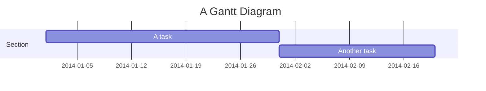
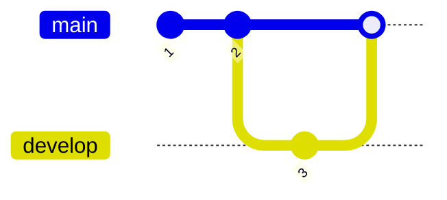
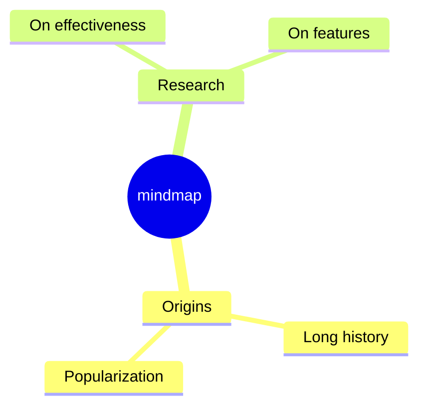

# Specification 005: Additional Mermaid Diagram Type Support

**Category**: optimization
**Priority**: low
**Status**: draft
**Dependencies**: 001, 002, 003, 004

## Context

Beyond the core diagram types (flowchart, state, class, sequence, ER), Mermaid supports additional specialized diagram types that are less commonly used but still important for comprehensive documentation coverage:

- **Gantt Charts**: Project timelines and task schedules
- **Git Graphs**: Version control branching and merging
- **User Journey**: Customer experience mapping
- **Timeline**: Chronological events
- **C4 Diagrams**: Software architecture (Context, Container, Component)
- **Mindmap**: Hierarchical concept maps
- **Pie Charts**: Statistical distributions
- **Quadrant Charts**: 2×2 matrix analysis
- **Requirement Diagrams**: Requirements traceability

These diagram types have varying viewport concerns and complexity characteristics. This spec addresses support for these secondary diagram types.

## Objective

Add support for remaining Mermaid diagram types, prioritizing those with significant viewport width/height concerns. Provide basic detection and analysis for all types, with detailed estimation for types that commonly exceed viewport constraints.

## Requirements

### Functional Requirements

1. **Diagram Type Detection**
   - Detect all remaining Mermaid diagram types
   - Add types to DiagramType union: `'gantt' | 'gitGraph' | 'journey' | 'timeline' | 'c4' | 'mindmap' | 'pie' | 'quadrant' | 'requirement'`
   - Correctly identify each diagram type from first line

2. **Priority 1: High-Width Diagrams**

   **Gantt Charts**
   - Parse task definitions and date ranges
   - Estimate width based on timeline span
   - Count task count for height
   - Warn when timeline > 6 months (width concern)

   **GitGraph**
   - Parse commit and branch definitions
   - Estimate width based on commit count
   - Count branch count for height
   - Warn when >20 commits horizontally

   **Mindmap**
   - Parse node hierarchy and relationships
   - Estimate radial width based on depth and breadth
   - Mindmaps can be very wide with deep hierarchies
   - Warn when depth >4 or breadth >6

3. **Priority 2: Moderate Concerns**

   **User Journey**
   - Parse sections and tasks
   - Width based on section count
   - Height based on task count per section
   - Warn when >6 sections

   **Timeline**
   - Parse events and date ranges
   - Width based on time span
   - Warn when >10 events

   **C4 Diagrams**
   - Parse containers/components
   - Similar to class diagrams in layout
   - Warn when >10 containers

4. **Priority 3: Low Concerns**

   **Pie Charts**
   - Fixed size, rarely exceed viewport
   - Basic detection only

   **Quadrant Charts**
   - Fixed 2×2 grid, small size
   - Basic detection only

   **Requirement Diagrams**
   - Similar to class diagrams
   - Basic detection, reuse class diagram logic

### Non-Functional Requirements

1. **Performance**: Each additional diagram type adds <5ms parsing overhead
2. **Incremental**: Can be implemented one type at a time
3. **Consistency**: Use similar estimation patterns across diagram types
4. **Extensibility**: Easy to add future Mermaid diagram types

## Acceptance Criteria

- [ ] All Mermaid diagram types are detected (not marked 'unknown')
- [ ] Gantt chart width estimation based on timeline span
- [ ] GitGraph width estimation based on commit count
- [ ] Mindmap radial width estimation
- [ ] User Journey width based on sections
- [ ] Timeline width based on events
- [ ] C4 diagram width based on container count
- [ ] Pie and quadrant charts detected but minimal analysis
- [ ] Tests cover all new diagram types
- [ ] Documentation includes examples for each type
- [ ] No performance regression

## Technical Details

### Implementation Approach

**Phase 1: Detection**
```typescript
// src/extractors/types.ts
export type DiagramType =
  | 'flowchart'
  | 'graph'
  | 'state'
  | 'class'
  | 'sequence'
  | 'er'
  | 'gantt'
  | 'gitGraph'
  | 'journey'
  | 'timeline'
  | 'c4'
  | 'mindmap'
  | 'pie'
  | 'quadrant'
  | 'requirement'
  | 'unknown';

// src/extractors/markdown.ts
function detectDiagramType(content: string): DiagramType {
  const firstLine = content.trim().split('\n')[0] || '';

  if (/^\s*gantt/i.test(firstLine)) return 'gantt';
  if (/^\s*gitGraph/i.test(firstLine)) return 'gitGraph';
  if (/^\s*journey/i.test(firstLine)) return 'journey';
  if (/^\s*timeline/i.test(firstLine)) return 'timeline';
  if (/^\s*C4(Context|Container|Component)/i.test(firstLine)) return 'c4';
  if (/^\s*mindmap/i.test(firstLine)) return 'mindmap';
  if (/^\s*pie/i.test(firstLine)) return 'pie';
  if (/^\s*quadrantChart/i.test(firstLine)) return 'quadrant';
  if (/^\s*requirementDiagram/i.test(firstLine)) return 'requirement';

  // ... existing logic
}
```

**Phase 2: Gantt Analysis**
```typescript
// src/graph/gantt-parser.ts
interface GanttAnalysis {
  tasks: Task[];
  taskCount: number;
  dateRange: { start: Date; end: Date };
  durationDays: number;
  estimatedWidth: number;
}

function parseGanttChart(content: string): GanttAnalysis {
  // Parse: dateFormat YYYY-MM-DD
  // Parse: task "Task name" :id, start, duration
  // Parse: section "Section name"
  // Calculate date range
  // Estimate: width = durationDays * pixelsPerDay
}
```

**Phase 3: GitGraph Analysis**
```typescript
// src/graph/gitgraph-parser.ts
interface GitGraphAnalysis {
  commits: Commit[];
  branches: string[];
  commitCount: number;
  branchCount: number;
  estimatedWidth: number;
}

function parseGitGraph(content: string): GitGraphAnalysis {
  // Parse: commit id: "abc123"
  // Parse: branch "feature"
  // Parse: merge "feature"
  // Estimate: width = commitCount * commitSpacing
}
```

**Phase 4: Mindmap Analysis**
```typescript
// src/graph/mindmap-parser.ts
interface MindmapAnalysis {
  nodes: MindmapNode[];
  maxDepth: number;
  maxBreadth: number;
  estimatedWidth: number; // Radial layout
}

function parseMindmap(content: string): MindmapAnalysis {
  // Parse: root((Central Idea))
  // Parse: Branch1, Branch2 (indentation = depth)
  // Calculate radial width: (maxDepth + maxBreadth) * nodeSpacing
}
```

### Architecture Changes

**New Modules**:
- `src/graph/gantt-parser.ts`
- `src/graph/gitgraph-parser.ts`
- `src/graph/mindmap-parser.ts`
- `src/graph/journey-parser.ts`
- `src/graph/timeline-parser.ts`
- `src/graph/c4-parser.ts`

**New Rules**:
- `gantt-timeline-width` - Warn on long timelines
- `gitgraph-width` - Warn on many commits
- `mindmap-size` - Warn on large mindmaps

### Complexity Thresholds

**Gantt Charts**:
- Warning: Timeline > 90 days (width ~1500px at 15px/day)
- Error: Timeline > 180 days (width ~2500px)

**GitGraph**:
- Warning: >15 commits
- Error: >25 commits
- Note: Branch count doesn't significantly affect width

**Mindmap**:
- Warning: Depth >3 OR Breadth >5
- Error: Depth >4 OR Breadth >7
- Radial layout makes size estimation complex

**User Journey**:
- Warning: >5 sections
- Error: >8 sections

**Timeline**:
- Warning: >8 events
- Error: >12 events

**C4 Diagrams**:
- Reuse class diagram thresholds
- Warning: >8 containers/components

## Dependencies

- **Prerequisites**: Specs 001-004 (core diagram types)
- **Affected Components**:
  - `src/extractors/types.ts` - Extend DiagramType
  - `src/extractors/markdown.ts` - Add all detections
  - Multiple new parser files
  - Multiple new rule files

## Testing Strategy

### Unit Tests

```typescript
// tests/unit/additional-diagrams.test.ts
describe('Additional Diagram Type Detection', () => {
  it('should detect gantt charts', () => {
    expect(detectDiagramType('gantt\n  title Project')).toBe('gantt');
  });

  it('should detect git graphs', () => {
    expect(detectDiagramType('gitGraph\n  commit')).toBe('gitGraph');
  });

  it('should detect mindmaps', () => {
    expect(detectDiagramType('mindmap\n  root((Idea))')).toBe('mindmap');
  });

  // ... tests for each type
});

describe('Gantt Chart Analysis', () => {
  it('should calculate timeline duration', () => {
    const content = `gantt
      dateFormat YYYY-MM-DD
      task1 :2024-01-01, 30d
      task2 :after task1, 20d`;
    const analysis = parseGanttChart(content);
    expect(analysis.durationDays).toBe(50);
  });
});
```

### Integration Tests

```typescript
it('should warn on long gantt charts', async () => {
  const results = await analyzeDiagramFile('fixtures/long-gantt.md');
  const issue = results.issues.find(i => i.rule === 'gantt-timeline-width');
  expect(issue).toBeDefined();
});
```

### Test Fixtures

Create fixtures for each diagram type:
- `tests/fixtures/gantt-*.md`
- `tests/fixtures/gitgraph-*.md`
- `tests/fixtures/mindmap-*.md`
- `tests/fixtures/journey-*.md`
- `tests/fixtures/timeline-*.md`
- `tests/fixtures/c4-*.md`

## Documentation Requirements

### User Documentation

Add examples for each supported diagram type:

```markdown
## Supported Diagram Types

### Core Diagram Types (Full Analysis)
- ✅ Flowcharts & Graphs
- ✅ State Diagrams
- ✅ Class Diagrams
- ✅ Sequence Diagrams
- ✅ ER Diagrams

### Additional Diagram Types (Basic Analysis)
- ✅ Gantt Charts (timeline width analysis)
- ✅ Git Graphs (commit count analysis)
- ✅ Mindmaps (radial size analysis)
- ✅ User Journey (section count analysis)
- ✅ Timeline (event count analysis)
- ✅ C4 Diagrams (container count analysis)
- ℹ️ Pie Charts (detection only)
- ℹ️ Quadrant Charts (detection only)

### Gantt Chart Example

\`\`\`mermaid
gantt
    title 6-Month Project
    dateFormat  YYYY-MM-DD
    section Phase 1
    Task 1           :2024-01-01, 30d
    Task 2           :after task1, 45d
    section Phase 2
    Task 3           :2024-03-01, 60d
    ...
\`\`\`

**Mermaid-sonar:**
\`\`\`
⚠️ Timeline spans 180 days (width: ~2500px)
→ Split into separate Gantt charts per phase
\`\`\`
```

## Implementation Notes

### Gantt Syntax



Width estimation:
- Parse dateFormat
- Extract all task start/end dates
- Calculate span: `(endDate - startDate).days`
- Estimate: `width = days × 15px/day`

### GitGraph Syntax



Width estimation:
- Count total commits
- Estimate: `width = commitCount × 50px`

### Mindmap Syntax



Size estimation (radial):
- Calculate tree depth (indentation levels)
- Calculate max breadth (most children at any level)
- Radial radius: `depth × 150px`
- Width: `2 × radius + breadth × 100px`

### Priority Implementation Order

1. **Phase 1** (High Priority): Gantt, GitGraph, Mindmap
2. **Phase 2** (Medium Priority): Journey, Timeline, C4
3. **Phase 3** (Low Priority): Pie, Quadrant, Requirement

Each phase can be implemented independently.

## Migration and Compatibility

### Breaking Changes

None. Additive only.

### Backward Compatibility

All existing diagram analysis unchanged.

## Success Metrics

- All Mermaid diagram types recognized (not 'unknown')
- Width/height analysis for high-priority types (Gantt, GitGraph, Mindmap)
- No performance regression
- User feedback confirms usefulness

## Future Enhancements

1. **Sankey Diagrams**: When Mermaid adds support
2. **Architecture Diagrams**: Additional C4 variants
3. **Custom Diagram Types**: Plugin system for custom types
4. **AI-Powered Suggestions**: ML-based diagram restructuring recommendations
