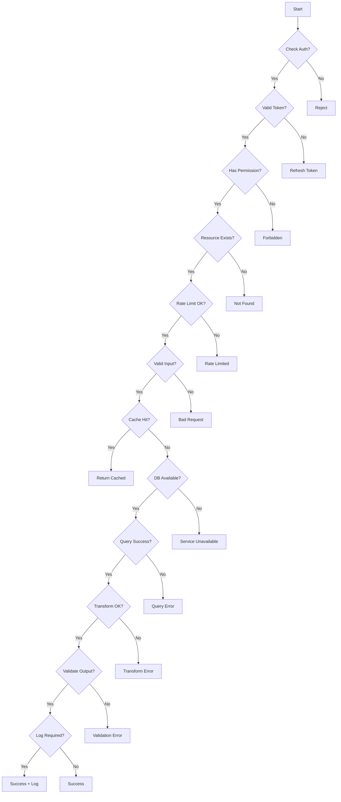

# Complex Decisions Test Fixture

This diagram has 12 decision nodes to trigger the cyclomatic complexity rule.

```mermaid
graph TD
    Start --> D1{Check Auth?}
    D1 -->|Yes| D2{Valid Token?}
    D1 -->|No| End1[Reject]
    D2 -->|Yes| D3{Has Permission?}
    D2 -->|No| End2[Refresh Token]
    D3 -->|Yes| D4{Resource Exists?}
    D3 -->|No| End3[Forbidden]
    D4 -->|Yes| D5{Rate Limit OK?}
    D4 -->|No| End4[Not Found]
    D5 -->|Yes| D6{Valid Input?}
    D5 -->|No| End5[Rate Limited]
    D6 -->|Yes| D7{Cache Hit?}
    D6 -->|No| End6[Bad Request]
    D7 -->|Yes| End7[Return Cached]
    D7 -->|No| D8{DB Available?}
    D8 -->|Yes| D9{Query Success?}
    D8 -->|No| End8[Service Unavailable]
    D9 -->|Yes| D10{Transform OK?}
    D9 -->|No| End9[Query Error]
    D10 -->|Yes| D11{Validate Output?}
    D10 -->|No| End10[Transform Error]
    D11 -->|Yes| D12{Log Required?}
    D11 -->|No| End11[Validation Error]
    D12 -->|Yes| End12[Success + Log]
    D12 -->|No| End13[Success]
```
