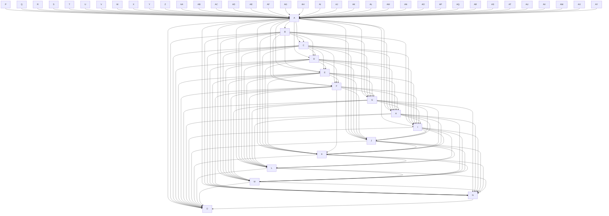

# High Density Test Fixture

This diagram has 51 nodes with high density (>0.3) to trigger the high-density rule.
With 15 nodes fully connected, we get: 15*14/2 = 105 edges, density = 105/(15*14) = 0.5

