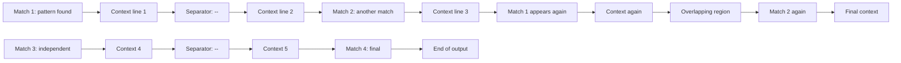

# Ripgrep Count List Example

This fixture represents a real-world example similar to ripgrep's count-list.md diagram.
It has an LR layout with 17 nodes and a longest chain of 6 nodes, which should:
- Pass with default profile (2500px max width)
- Fail/warn with mkdocs profile (800px max width)

This diagram demonstrates:
- **Layout**: LR (left-to-right)
- **Node count**: 17 nodes
- **Longest chain**: M1 -> C1 -> SEP1 -> C2 -> M2 -> C3 (6 nodes)
- **Estimated width**: ~2400px with default labels (passes default, fails mkdocs)
