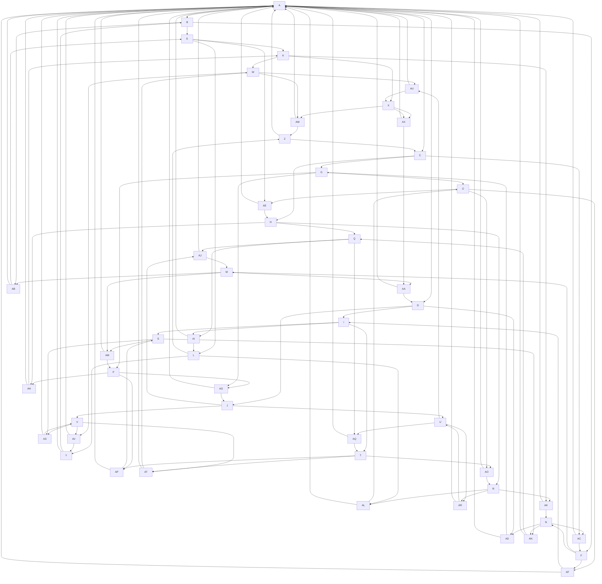

# Too Many Edges Test Fixture

This diagram has 50 nodes with 120 edges to trigger the max-edges rule.

```mermaid
graph TD
    A --> B
    A --> C
    A --> D
    B --> E
    B --> F
    C --> G
    C --> H
    D --> I
    D --> J
    E --> K
    E --> L
    F --> M
    F --> N
    G --> O
    G --> P
    H --> Q
    H --> R
    I --> S
    I --> T
    J --> U
    J --> V
    K --> W
    K --> X
    L --> Y
    L --> Z
    M --> AA
    M --> AB
    N --> AC
    N --> AD
    O --> AE
    O --> AF
    P --> AG
    P --> AH
    Q --> AI
    Q --> AJ
    R --> AK
    R --> AL
    S --> AM
    S --> AN
    T --> AO
    T --> AP
    U --> AQ
    U --> AR
    V --> AS
    V --> AT
    W --> AU
    W --> AV
    X --> AW
    X --> AX
    Y --> B
    Z --> C
    AA --> D
    AB --> E
    AC --> F
    AD --> G
    AE --> H
    AF --> I
    AG --> J
    AH --> K
    AI --> L
    AJ --> M
    AK --> N
    AL --> O
    AM --> P
    AN --> Q
    AO --> R
    AP --> S
    AQ --> T
    AR --> U
    AS --> V
    AT --> W
    AU --> X
    AV --> Y
    AW --> Z
    AX --> AA
    B --> AB
    C --> AC
    D --> AD
    E --> AE
    F --> AF
    G --> AG
    H --> AH
    I --> AI
    J --> AJ
    K --> AK
    L --> AL
    M --> AM
    N --> AN
    O --> AO
    P --> AP
    Q --> AQ
    R --> AR
    S --> AS
    T --> AT
    U --> AU
    V --> AV
    W --> AW
    X --> AX
    Y --> A
    Z --> A
    AA --> A
    AB --> A
    AC --> A
    AD --> A
    AE --> A
    AF --> A
    AG --> A
    AH --> A
    AI --> A
    AJ --> A
    AK --> A
    AL --> A
    AM --> A
    AN --> A
    AO --> A
    AP --> A
    AQ --> A
    AR --> A
    AS --> A
    AT --> A
    AU --> A
    AV --> A
    AW --> A
    AX --> A
```
