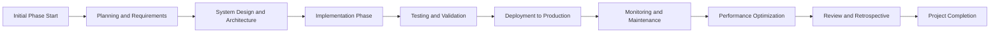

# Wide LR Layout Test Fixture

This fixture tests the horizontal-width-readability rule for LR layouts.

```mermaid
graph LR
  START[Initial Phase Start] --> PLAN[Planning and Requirements]
  PLAN --> DESIGN[System Design and Architecture]
  DESIGN --> IMPL[Implementation Phase]
  IMPL --> TEST[Testing and Validation]
  TEST --> DEPLOY[Deployment to Production]
  DEPLOY --> MONITOR[Monitoring and Maintenance]
  MONITOR --> OPT[Performance Optimization]
  OPT --> REVIEW[Review and Retrospective]
  REVIEW --> END[Project Completion]
```
