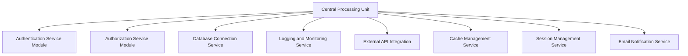

# Wide TD Branches Test Fixture

This fixture tests the horizontal-width-readability rule for TD layouts with wide branching.

```mermaid
graph TD
  ROOT[Central Processing Unit] --> BRANCH1[Authentication Service Module]
  ROOT --> BRANCH2[Authorization Service Module]
  ROOT --> BRANCH3[Database Connection Service]
  ROOT --> BRANCH4[Logging and Monitoring Service]
  ROOT --> BRANCH5[External API Integration]
  ROOT --> BRANCH6[Cache Management Service]
  ROOT --> BRANCH7[Session Management Service]
  ROOT --> BRANCH8[Email Notification Service]
```
